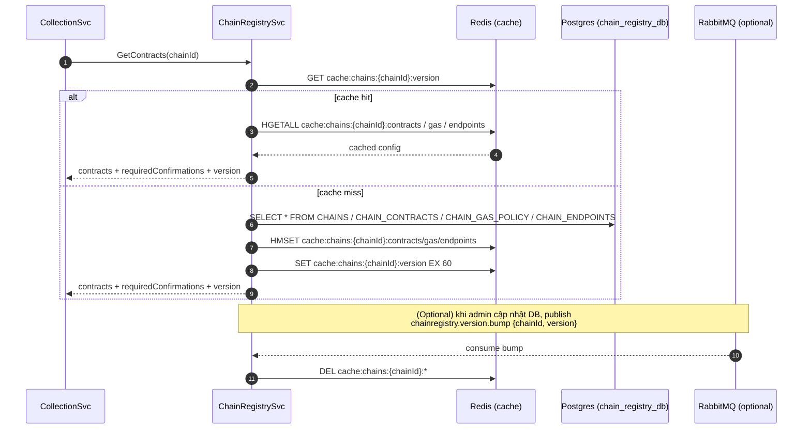

```proto
syntax = "proto3";

package chainregistry;
option go_package = "shared/proto/chainregistry;chainregistry";

// ===== Models =====
message Contract {
  string name = 1;            // e.g. "Factory", "Policy"
  string address = 2;         // 0x...
  int32  start_block = 3;     // optional
  string verified_at = 4;     // RFC3339 optional
}

message GasPolicy {
  double max_fee_gwei = 1;
  double priority_fee_gwei = 2;
  double multiplier = 3;                 // multiply basefee if needed
  double last_observed_base_fee_gwei = 4;
  string updated_at = 5;                 // RFC3339
}

message RpcEndpoint {
  string url = 1;
  int32  priority = 2;       // lower = higher priority
  int32  weight = 3;         // load weighting
  string auth_type = 4;      // NONE|KEY|BASIC|BEARER...
  int32  rate_limit = 5;     // req/s or 0
  bool   active = 6;
}

// ===== Requests / Responses =====
message GetContractsRequest {
  string chain_id = 1;       // CAIP-2, e.g., "eip155:1"
}
message GetContractsResponse {
  string chain_id = 1;
  uint32 chain_numeric = 2;          // 1, 8453, ...
  repeated Contract contracts = 3;   // at least Factory
  uint32 required_confirmations = 4; // per chain
  string registry_version = 5;       // for cache-busting
  string native_symbol = 6;          // ETH, MATIC, ...
}

message GetGasPolicyRequest { string chain_id = 1; }
message GetGasPolicyResponse {
  string chain_id = 1;
  GasPolicy policy = 2;
  string registry_version = 3;
}

message GetRpcEndpointsRequest { string chain_id = 1; }
message GetRpcEndpointsResponse {
  string chain_id = 1;
  repeated RpcEndpoint endpoints = 2;
  string registry_version = 3;
}

// Optional admin invalidation (if bạn muốn đẩy từ control-plane)
message BumpVersionRequest { string chain_id = 1; string reason = 2; }
message BumpVersionResponse { bool ok = 1; string new_version = 2; }

// ===== Service =====
service ChainRegistryService {
  rpc GetContracts     (GetContractsRequest)     returns (GetContractsResponse);
  rpc GetGasPolicy     (GetGasPolicyRequest)     returns (GetGasPolicyResponse);
  rpc GetRpcEndpoints  (GetRpcEndpointsRequest)  returns (GetRpcEndpointsResponse);

  // optional:
  rpc BumpVersion      (BumpVersionRequest)      returns (BumpVersionResponse);
}


```


```graphql
scalar ChainId
scalar Address
scalar URL
scalar DateTime

type Contract {
  name: String!
  address: Address!
  startBlock: Int
  verifiedAt: DateTime
}

type GasPolicy {
  maxFeeGwei: Float!
  priorityFeeGwei: Float!
  multiplier: Float!
  lastObservedBaseFeeGwei: Float
  updatedAt: DateTime
}

type RpcEndpoint {
  url: URL!
  priority: Int!
  weight: Int!
  authType: String
  rateLimit: Int
  active: Boolean!
}

type ChainContracts {
  chainId: ChainId!
  chainNumeric: Int!
  nativeSymbol: String
  contracts: [Contract!]!
  requiredConfirmations: Int!
  registryVersion: String!
}

type ChainGasPolicy {
  chainId: ChainId!
  policy: GasPolicy!
  registryVersion: String!
}

type ChainRpcEndpoints {
  chainId: ChainId!
  endpoints: [RpcEndpoint!]!
  registryVersion: String!
}

type Query {
  chainContracts(chainId: ChainId!): ChainContracts!
  chainGasPolicy(chainId: ChainId!): ChainGasPolicy!
  chainRpcEndpoints(chainId: ChainId!): ChainRpcEndpoints!
}

# Optional admin
input BumpChainVersionInput { chainId: ChainId!, reason: String }
type BumpChainVersionPayload { ok: Boolean!, newVersion: String! }

type Mutation {
  bumpChainVersion(input: BumpChainVersionInput!): BumpChainVersionPayload!
}


```
