# Database Architecture Diagrams

## Complete Database Schema Overview

```mermaid
erDiagram
    auth_nonces {
        varchar nonce PK
        varchar account_id
        varchar domain
        varchar chain_id
        timestamp expires_at
        boolean used
    }
    
    sessions {
        uuid session_id PK
        uuid user_id FK
        varchar refresh_hash
        timestamp expires_at
        timestamp revoked_at
        jsonb collection_intent_context
    }
    
    login_events {
        uuid id PK
        uuid user_id FK
        varchar account_id
        varchar result
        timestamp event_timestamp
    }

    users {
        uuid user_id PK
        varchar status
        timestamp created_at
    }
    
    profiles {
        uuid user_id PK
        varchar username "UNIQUE"
        varchar display_name
        text bio
        text avatar_url
    }
    
    user_preferences {
        uuid user_id PK
        varchar theme
        varchar privacy_level
        boolean email_notifications
    }
    
    user_stats {
        uuid user_id PK
        integer collections_count
        integer items_count
        numeric volume_sold
        integer followers_count
    }
    
    user_follows {
        uuid follower_id PK
        uuid following_id PK
        timestamp created_at
    }

    wallet_links {
        uuid wallet_id PK
        uuid user_id FK
        varchar address
        varchar chain_id
        boolean is_primary
        varchar wallet_type
    }
    
    wallet_activity {
        uuid id PK
        uuid wallet_id FK
        varchar action
        jsonb metadata
    }
    
    wallet_verifications {
        uuid id PK
        uuid wallet_id FK
        varchar status
        jsonb verification_data
    }

    collections {
        uuid id PK
        text slug "UNIQUE"
        text name
        text chain_id
        text contract_address
        text creator
        text floor_price
        text volume_traded
    }
    
    tokens {
        uuid id PK
        uuid collection_id FK
        text token_number
        text owner_address
        text image_url
        boolean burned
    }
    
    traits {
        uuid id PK
        uuid collection_id FK
        text name
        text value_type
    }
    
    trait_values {
        uuid id PK
        uuid trait_id FK
        text value_string
        numeric rarity_score
    }
    
    token_trait_links {
        uuid token_id PK
        uuid trait_id PK
        uuid trait_value_id PK
    }
    
    marketplaces {
        uuid id PK
        text name "UNIQUE"
    }
    
    listings {
        uuid id PK
        uuid token_id FK
        uuid marketplace_id FK
        numeric price_native
        boolean is_active
    }
    
    offers {
        uuid id PK
        uuid token_id FK
        uuid marketplace_id FK
        numeric price_native
        text from_address
    }
    
    sales {
        uuid id PK
        uuid token_id FK
        uuid marketplace_id FK
        numeric price_native
        timestamp occurred_at
    }
    
    activities {
        uuid id PK
        uuid token_id FK
        text activity_type
        numeric price_native
        timestamp activity_timestamp
    }
    
    collection_stats {
        uuid collection_id PK
        integer items_count
        integer owners_count
        numeric floor_price_native
    }
    
    token_balances {
        text chain_id
        text contract
        text token_id
        text owner
        numeric quantity
    }
    
    ownership_transfers {
        text chain_id
        text contract
        text token_id
        text from_addr
        text to_addr
        text tx_hash
    }

    chains {
        integer id PK
        text caip2 "UNIQUE"
        integer chain_numeric "UNIQUE"
        text name
        boolean enabled
    }
    
    chain_endpoints {
        integer id PK
        integer chain_id FK
        text url
        integer priority
        boolean active
    }
    
    abi_blobs {
        varchar sha256 PK
        text standard
        jsonb abi_json
        text s3_key
    }
    
    chain_contracts {
        bigint id PK
        integer chain_id FK
        text address
        varchar abi_sha256 FK
        text standard
    }

    tx_intents {
        uuid intent_id PK
        text kind
        text chain_id
        text tx_hash
        text status
        uuid created_by FK
        varchar auth_session_id
    }
    
    session_intent_audit {
        uuid audit_id PK
        varchar session_id
        uuid intent_id FK
        uuid user_id FK
    }

    indexer_checkpoints {
        text chain_id PK
        bigint last_block
        text last_block_hash
        timestamp updated_at
    }

    users ||--|| profiles : has
    users ||--|| user_preferences : has
    users ||--|| user_stats : has
    users ||--o{ user_follows : follower
    users ||--o{ user_follows : following
    users ||--o{ wallet_links : owns
    users ||--o{ tx_intents : creates
    
    sessions }o--|| users : authenticates
    login_events }o--|| users : logs
    sessions ||--o{ session_intent_audit : correlates
    
    wallet_links ||--o{ wallet_activity : tracks
    wallet_links ||--o{ wallet_verifications : verifies
    
    collections ||--o{ tokens : contains
    collections ||--o{ traits : defines
    collections ||--|| collection_stats : has_stats
    tokens ||--o{ listings : listed_on
    tokens ||--o{ offers : receives
    tokens ||--o{ sales : sold_in
    tokens ||--o{ activities : generates
    tokens ||--o{ token_trait_links : has_traits
    traits ||--o{ trait_values : has_values
    trait_values ||--o{ token_trait_links : linked_to
    marketplaces ||--o{ listings : hosts
    marketplaces ||--o{ offers : processes
    marketplaces ||--o{ sales : records
    
    chains ||--o{ chain_endpoints : has_endpoints
    chains ||--o{ chain_contracts : deploys
    abi_blobs ||--o{ chain_contracts : used_by
    
    tx_intents ||--o{ session_intent_audit : audited
    session_intent_audit }o--|| users : references
```

## System Overview

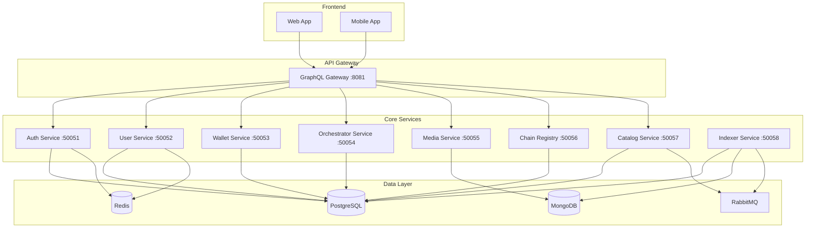

## Auth Service Schema

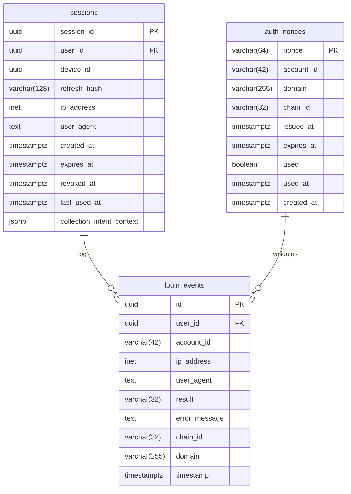

## User Service Schema

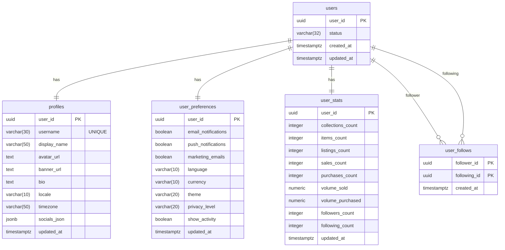

## Wallet Service Schema

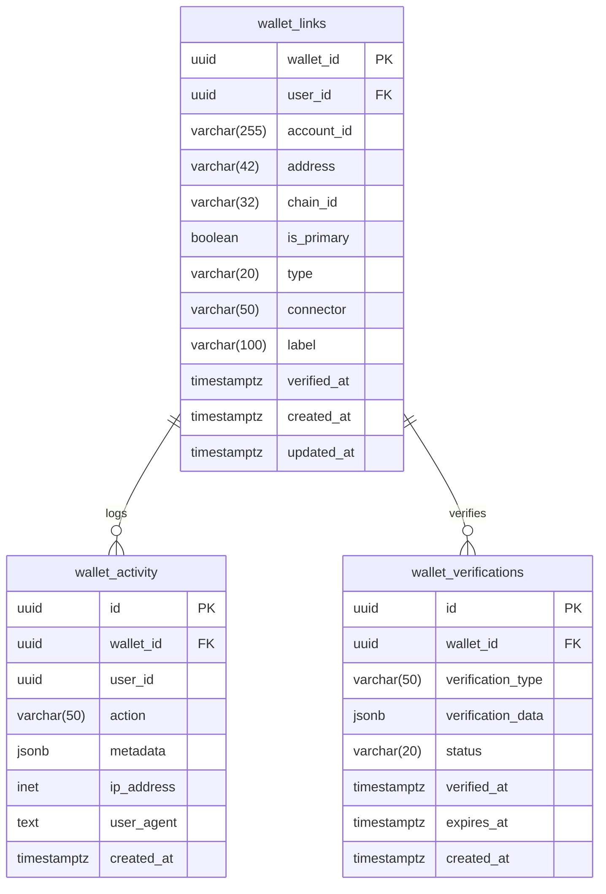

## Catalog Service Schema (Core Tables)

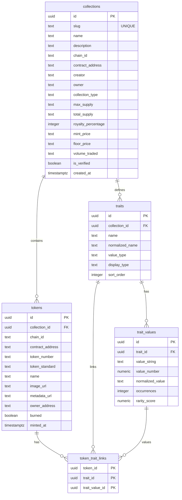

## Catalog Service Schema (Marketplace)

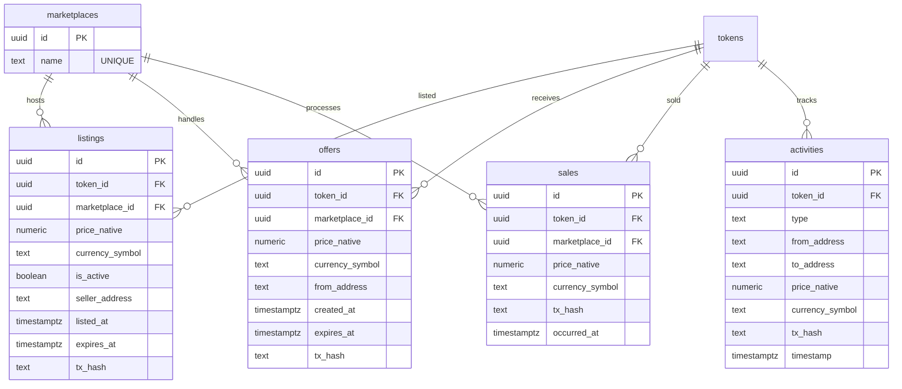

## Chain Registry Schema

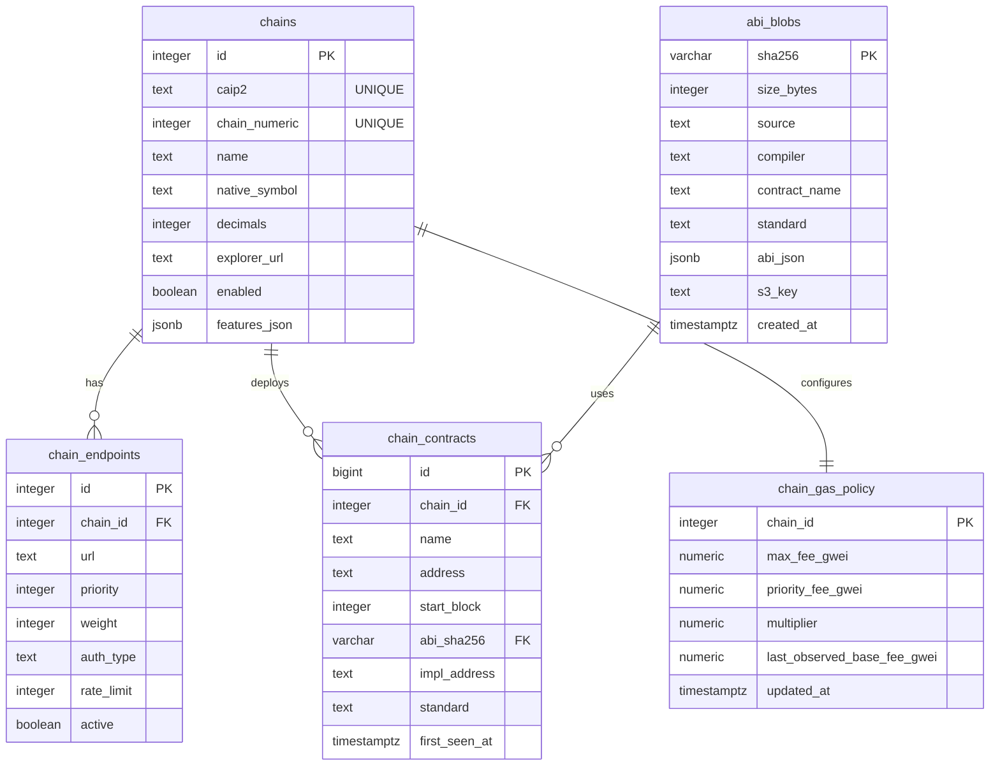

## Orchestrator Service Schema

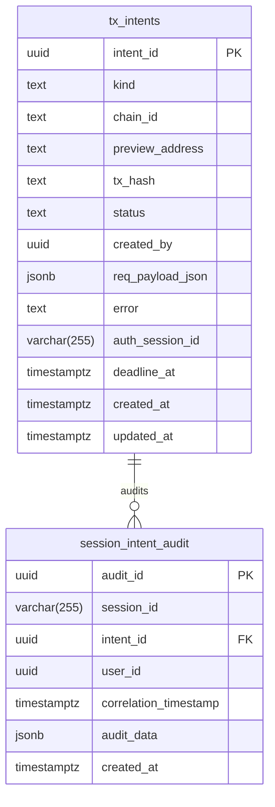

## Cross-Service Relationships

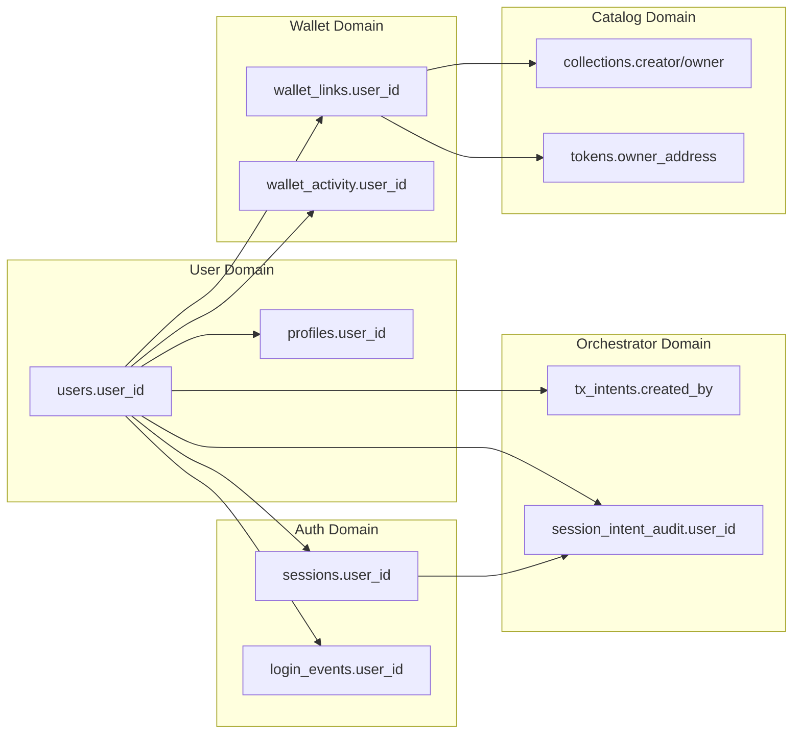

## Data Flow for Collection Creation

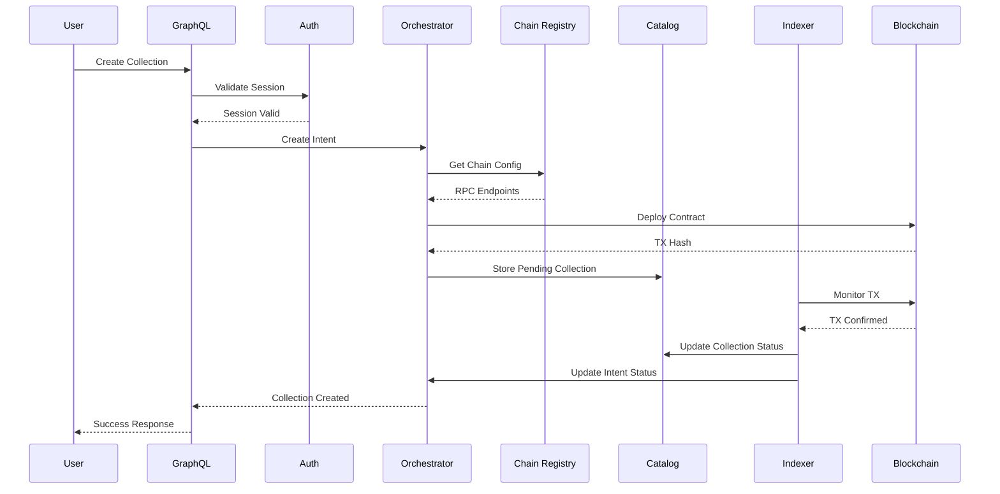

## MongoDB Collections Structure

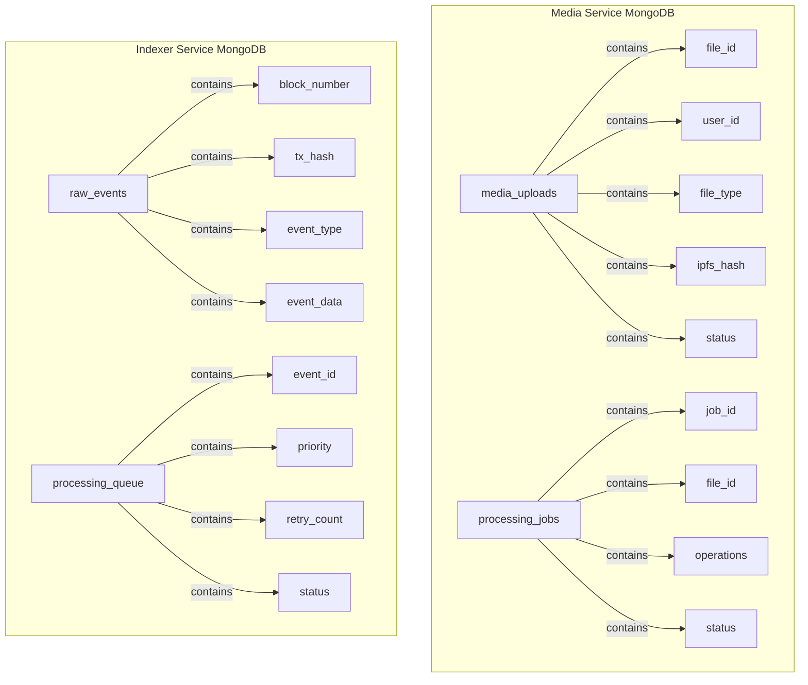

## Service Port Mapping

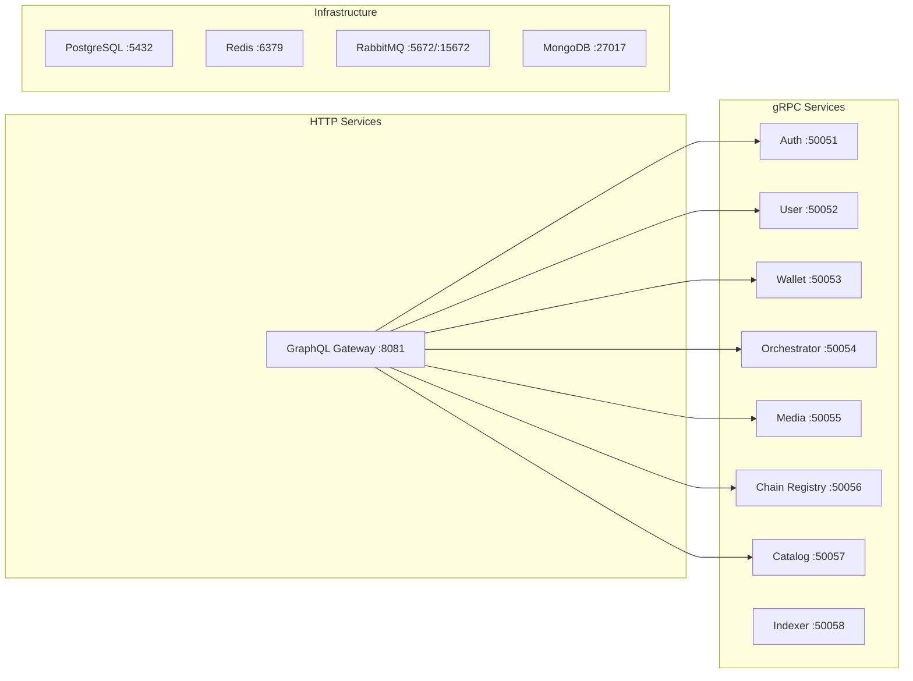

## Database Size Estimates

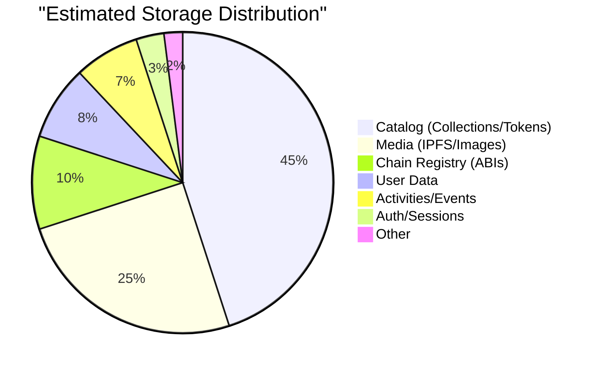
