# Database Schema Documentation

## Entity Relationship Diagram

```mermaid
erDiagram
  %% ======================= AUTH SERVICE (Postgres) =======================
  AUTH_NONCES {
    string   nonce PK
    string   account_id
    string   domain
    string   chain_id
    datetime issued_at
    datetime expires_at
    boolean  used
  }

  SESSIONS {
    uuid     session_id PK
    uuid     user_id
    uuid     device_id
    string   refresh_hash
    string   ip
    string   ua
    datetime created_at
    datetime expires_at
    datetime revoked_at
    datetime last_used_at
  }

  LOGIN_EVENTS {
    uuid     id PK
    uuid     user_id
    string   account_id
    string   ip
    string   ua
    string   result
    datetime ts
  }

  SESSIONS ||..|| LOGIN_EVENTS : audit

  %% ======================= WALLET SERVICE (Postgres) =======================
  WALLETS {
    uuid     id PK
    uuid     user_id
    string   account_id
    string   address
    string   chain_id
    string   type
    string   connector
    boolean  is_primary
    string   label
    datetime verified_at
    datetime created_at
    datetime updated_at
    datetime last_seen_at
  }

  APPROVALS {
    uuid     wallet_id
    string   chain_id
    string   operator
    string   standard
    boolean  approved
    datetime approved_at
    datetime revoked_at
    string   tx_hash
    datetime updated_at
  }

  APPROVALS_HISTORY {
    uuid     id PK
    uuid     wallet_id
    string   chain_id
    string   operator
    string   standard
    boolean  approved
    string   tx_hash
    datetime at
  }

  WALLETS ||--o{ APPROVALS : has
  WALLETS ||--o{ APPROVALS_HISTORY : changes

  %% ======================= USER / PROFILE (Postgres) =======================
  USERS {
    uuid     id PK
    string   status
    datetime created_at
  }

  PROFILES {
    uuid     user_id PK
    string   username
    string   display_name
    string   avatar_url
    string   banner_url
    string   bio
    string   locale
    string   timezone
    string   socials_json
    datetime updated_at
  }

  USERS ||--|| PROFILES : owns
  USERS ||--o{ WALLETS : has

  %% ======================= CHAIN REGISTRY (Postgres) =======================
  CHAINS {
    int      id PK
    string   caip2
    int      chain_numeric
    string   name
    string   native_symbol
    int      decimals
    string   explorer_url
    boolean  enabled
    string   features_json
  }

  CHAIN_ENDPOINTS {
    int      id PK
    int      chain_id
    string   url
    int      priority
    int      weight
    string   auth_type
    int      rate_limit
    boolean  active
  }

  CHAIN_CONTRACTS {
    int      id PK
    int      chain_id
    string   name
    string   address
    int      start_block
    datetime verified_at
  }

  CHAIN_GAS_POLICY {
    int      chain_id PK
    float    max_fee_gwei
    float    priority_fee_gwei
    float    multiplier
    float    last_observed_base_fee_gwei
    datetime updated_at
  }

  CHAINS ||--o{ CHAIN_ENDPOINTS : has
  CHAINS ||--o{ CHAIN_CONTRACTS : has
  CHAINS ||--|| CHAIN_GAS_POLICY : has

  %% ======================= ORCHESTRATOR (Postgres) =======================
  TX_INTENTS {
    uuid     intent_id PK
    string   kind
    string   chain_id
    string   preview_address
    string   tx_hash
    string   status
    uuid     created_by
    string   req_payload_json
    string   error
    datetime deadline_at
    datetime created_at
    datetime updated_at
  }

  %% ======================= INDEXER (PG + Mongo) =======================
  INDEXER_CHECKPOINTS {
    string   chain_id PK
    int      last_block
    string   last_block_hash
    datetime updated_at
  }

  EVENTS_RAW {
    string   _id PK
    string   eventId
    string   chainId
    int      blockNumber
    string   blockHash
    string   txHash
    int      logIndex
    string   address
    string   topics_json
    string   data
    string   parsed_json
    datetime observedAt
    int      confirmations
  }

  %% ======================= CATALOG (Postgres) =======================
  COLLECTIONS {
    uuid     id PK
    string   slug
    string   name
    string   description
    string   category
    string   image_url
    string   banner_url
    string   website_url
    string   social_links_json
    boolean  is_verified
    boolean  is_hidden
    string   source
    int      total_supply
    int      royalty_bps
    string   royalty_receiver
    string   metadata_standard
    string   status
    datetime mint_start_date
    datetime mint_end_date
    int      total_minted
    int      max_supply
    string   mint_price_text
    int      deployed_block
    string   index_status
    string   tags_json
    string   settings_json
    datetime created_at
    datetime updated_at
  }

  COLLECTION_ROLES {
    string   chain_id
    string   address
    string   role
    string   account
    datetime granted_at
  }

  COLLECTION_BINDINGS {
    uuid     id PK
    uuid     collection_id
    string   chain_id
    string   family
    string   token_standard
    string   contract_address
    string   mint_authority
    string   inscription_id
    boolean  is_primary
  }

  COLLECTION_MINT_CONFIG {
    uuid     collection_id PK
    datetime start_date
    datetime end_date
    string   mint_price_text
  }

  TOKENS {
    uuid     id PK
    uuid     collection_id
    string   chain_id
    string   family
    string   contract_address
    string   mint_address
    string   inscription_id
    string   token_number
    string   token_standard
    int      supply
    boolean  burned
    string   name
    string   image_url
    string   metadata_url
    string   owner_address
    int      minted_block
    datetime minted_at
    datetime last_refresh_at
    string   metadata_doc
  }

  TRAITS {
    uuid     id PK
    uuid     collection_id
    string   name
    string   normalized_name
    string   value_type
    string   display_type
    string   unit
    int      sort_order
  }

  TRAIT_VALUES {
    uuid     id PK
    uuid     trait_id
    string   value_type
    string   value_string
    float    value_number
    bigint   value_epoch_seconds
    string   normalized_value
    int      occurrences
    float    frequency
    float    rarity_score
    float    max_value
    string   unit
  }

  TOKEN_TRAIT_LINKS {
    uuid     token_id
    uuid     trait_id
    uuid     trait_value_id
  }

  TOKEN_BALANCES {
    string   chain_id
    string   contract
    string   token_id
    string   owner
    numeric  quantity
    datetime updated_at
  }

  OWNERSHIP_TRANSFERS {
    string   chain_id
    string   contract
    string   token_id
    string   from_addr
    string   to_addr
    string   tx_hash
    int      log_index
    datetime at
  }

  NFT_FLAGS {
    string   chain_id
    string   contract
    string   token_id
    boolean  is_flagged
    boolean  is_spam
    boolean  is_frozen
    boolean  is_nsfw
    boolean  refreshable
    string   reason_json
    datetime updated_at
  }

  MARKETPLACES {
    uuid     id PK
    string   name
  }

  LISTINGS {
    uuid     id PK
    uuid     token_id
    uuid     marketplace_id
    numeric  price_native
    string   price_native_text
    string   currency_symbol
    boolean  is_active
    datetime listed_at
    datetime updated_at
    string   seller_address
    datetime expires_at
    string   url
    string   tx_hash
  }

  OFFERS {
    uuid     id PK
    uuid     token_id
    uuid     marketplace_id
    numeric  price_native
    string   price_native_text
    string   currency_symbol
    string   from_address
    datetime created_at
    datetime expires_at
    string   tx_hash
  }

  SALES {
    uuid     id PK
    uuid     token_id
    uuid     marketplace_id
    numeric  price_native
    string   price_native_text
    string   currency_symbol
    string   tx_hash
    datetime occurred_at
  }

  ORDERS {
    uuid     id PK
    uuid     token_id
    string   side
    string   maker
    string   taker
    numeric  price_native
    string   currency_symbol
    datetime start_at
    datetime end_at
    string   signature
    string   salt
    string   source_marketplace
    string   status
    datetime updated_at
  }

  ORDER_FILLS {
    uuid     id PK
    uuid     order_id
    string   tx_hash
    numeric  price_native
    datetime filled_at
  }

  COLLECTION_STATS {
    uuid     collection_id PK
    int      items_count
    int      owners_count
    numeric  floor_price_native
    string   floor_currency_symbol
    numeric  market_cap_est
    datetime last_updated_at
  }

  TOKEN_RARITY {
    uuid     token_id PK
    float    rarity_score_product
  }

  RARITY_SCORES {
    uuid     token_id
    string   method
    string   source
    float    score
    int      rank
    datetime updated_at
  }

  TRAIT_VALUE_FLOOR {
    uuid     trait_value_id PK
    numeric  floor_price_native
    datetime last_updated_at
  }

  ACTIVITIES {
    uuid     id PK
    uuid     token_id
    string   type
    string   from_address
    string   to_address
    numeric  price_native
    string   price_native_text
    string   currency_symbol
    string   tx_hash
    string   block_or_slot
    datetime timestamp
    string   marketplace
  }

  SYNC_STATE {
    uuid     id PK
    uuid     collection_id
    string   source
    string   cursor
    datetime last_run_at
    string   note
  }

  PROCESSED_EVENTS {
    string   event_id PK
    int      event_version
    string   chain_id
    string   block_hash
    int      log_index
    datetime processed_at
  }

  %% ======================= MEDIA (Mongo) =======================
  METADATA_DOCS {
    string   _id PK
    string   chainId
    string   contract
    string   tokenId
    string   tokenURI
    string   original_json
    string   normalized_json
    string   media_json
    string   normalize_status
    string   normalize_error
    datetime fetchedAt
    string   etag
  }

  MEDIA_ASSETS {
    string   _id PK
    string   cid
    string   kind
    string   source
    string   mime
    int      bytes
    int      width
    int      height
    string   s3Key
    string   ipfsCid
    string   sha256
    string   phash
    string   moderation
    string   exif_json
    datetime createdAt
  }

  MEDIA_VARIANTS {
    string   asset_id
    string   cdnUrl
    int      w
    int      h
  }

  %% ======================= RELATIONSHIPS =======================
  %% Auth/User
  USERS ||--o{ SESSIONS : sessions

  %% Wallet/User
  USERS ||--o{ WALLETS : has
  WALLETS ||--o{ APPROVALS : has
  WALLETS ||--o{ APPROVALS_HISTORY : changes

  %% Chain registry
  CHAINS ||--o{ CHAIN_ENDPOINTS : has
  CHAINS ||--o{ CHAIN_CONTRACTS : has
  CHAINS ||--|| CHAIN_GAS_POLICY : has

  %% Catalog domain
  COLLECTIONS ||--o{ COLLECTION_ROLES : roles
  COLLECTIONS ||--o{ COLLECTION_BINDINGS : has
  COLLECTIONS ||--o{ COLLECTION_MINT_CONFIG : has
  COLLECTIONS ||--o{ TOKENS : contains

  TRAITS ||--o{ TRAIT_VALUES : has
  TOKENS ||--o{ TOKEN_TRAIT_LINKS : has
  TRAITS ||--o{ TOKEN_TRAIT_LINKS : link
  TRAIT_VALUES ||--o{ TOKEN_TRAIT_LINKS : link

  MARKETPLACES ||--o{ LISTINGS : has
  MARKETPLACES ||--o{ OFFERS : has
  MARKETPLACES ||--o{ SALES : has
  TOKENS ||--o{ LISTINGS : has
  TOKENS ||--o{ OFFERS : has
  TOKENS ||--o{ SALES : has
  TOKENS ||--o{ ACTIVITIES : has

  COLLECTIONS ||--|| COLLECTION_STATS : has
  TOKENS ||--|| TOKEN_RARITY : has
  TRAIT_VALUES ||--|| TRAIT_VALUE_FLOOR : has

  TOKENS ||--o{ TOKEN_BALANCES : balances
  TOKENS ||--o{ OWNERSHIP_TRANSFERS : history
  TOKENS ||--|| NFT_FLAGS : flags

  TOKENS ||--o{ ORDERS : has
  ORDERS ||--o{ ORDER_FILLS : fills

  COLLECTIONS ||--o{ SYNC_STATE : has

  MEDIA_ASSETS ||--o{ MEDIA_VARIANTS : has
  TOKENS ||..|| METADATA_DOCS : metadata_doc

  %% Indexer/Catalog idempotency
  PROCESSED_EVENTS ||..|| LISTINGS : guard
  PROCESSED_EVENTS ||..|| OFFERS   : guard
  PROCESSED_EVENTS ||..|| SALES    : guard
  PROCESSED_EVENTS ||..|| TOKENS   : guard
  INDEXER_CHECKPOINTS ||..|| EVENTS_RAW : drive
```

## Database Distribution

### PostgreSQL Databases
- **auth_db**: Authentication, sessions, nonces
- **user_db**: User profiles and account information
- **wallets_db**: Wallet connections and approvals
- **chain_registry_db**: Chain configurations and contracts
- **orchestrator_db**: Transaction intents and orchestration
- **indexer_db**: Blockchain indexing checkpoints
- **catalog_db**: Collections, NFTs, marketplace data

### MongoDB Collections
- **events.raw**: Raw blockchain event logs
- **metadata.docs**: NFT metadata normalization
- **media.assets**: Media files and variants

### Redis Stores
- **Authentication**: Session management, nonce validation
- **Chain Registry**: Contract and policy caching
- **Intent Status**: Real-time transaction tracking
- **Read Cache**: Query result caching