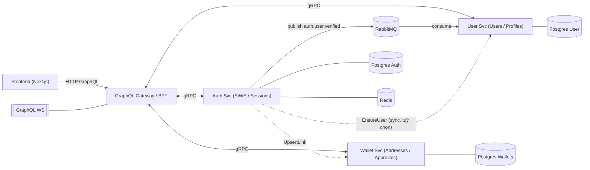
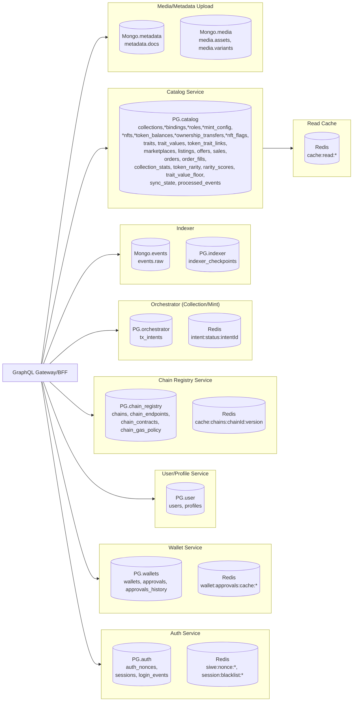
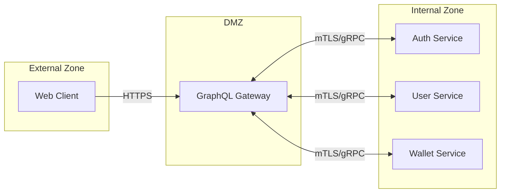
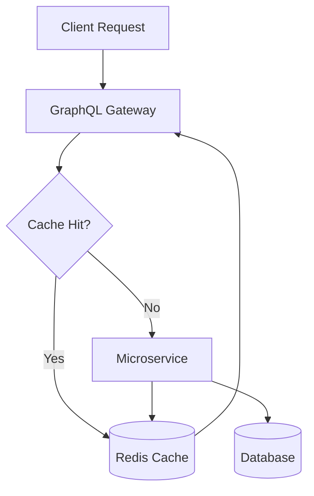
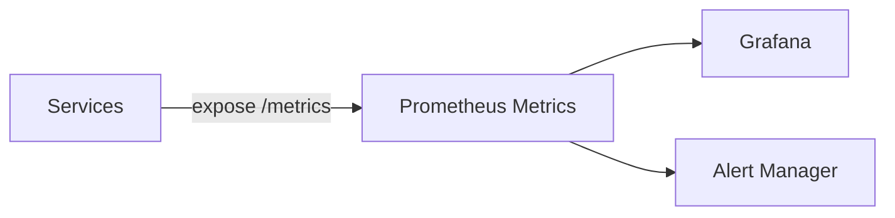

# System Architecture Overview

## Documentation Index

- [Database Schema](./database-schema.md) - Detailed database schema documentation
- [Database Diagrams](./database-diagram.md) - Visual database architecture with Mermaid diagrams
- [Production Readiness](../production-readiness.md) - Production features and deployment guide
- [API Documentation](../api/README.md) - Complete API reference and examples

## Microservices Architecture



## Service Database Mapping



## Message Queue Architecture

```rabbitmq
Exchange

auth.events (topic, durable) → sự kiện của Auth

wallets.events (topic, durable) → sự kiện của Wallet

dlx.events (topic, durable) → dead-letter exchange dùng chung

Queues

subs.auth.logged_in ← bind auth.events với key user.logged_in

subs.wallets.linked ← bind wallets.events với key wallet.linked

Mỗi queue gắn DLX + TTL retry
```

## Production Security Architecture

### mTLS Communication


### Security Features
- **Authentication**: SIWE with refresh token rotation
- **Authorization**: Role-based access control with GraphQL directives
- **Encryption**: mTLS for all internal communication
- **Rate Limiting**: Token bucket algorithm at GraphQL layer
- **Session Security**: Device fingerprinting and tracking
- **Input Validation**: Schema validation and sanitization

## Performance Architecture

### Caching Strategy


### Connection Pooling
- **PostgreSQL**: Service-specific pool configurations
- **Redis**: Cluster-aware connection pooling
- **gRPC**: Connection reuse with keep-alive

### Circuit Breakers
- Automatic failure detection
- Service isolation during outages
- Gradual recovery with half-open state

## Monitoring & Observability

### Metrics Collection


### Logging Pipeline
- **Structured Logging**: JSON format with zerolog
- **Log Aggregation**: Centralized log collection
- **Correlation IDs**: Request tracing across services
- **Audit Trail**: Security and compliance logging

### Health Checks
- `/health` - Liveness probe
- `/ready` - Readiness probe
- `/metrics` - Prometheus metrics endpoint