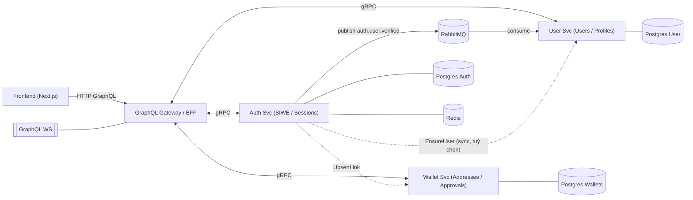
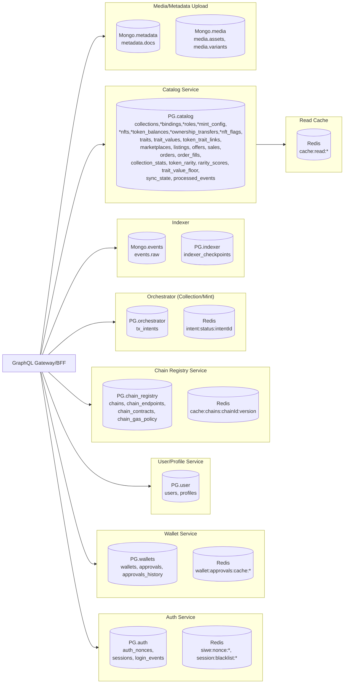

# System Architecture Overview

## Documentation Index

- [Database Schema](./database-schema.md) - Detailed database schema documentation
- [Database Diagrams](./database-diagram.md) - Visual database architecture with Mermaid diagrams

## Microservices Architecture



## Service Database Mapping



## Message Queue Architecture

```rabbitmq
Exchange

auth.events (topic, durable) → sự kiện của Auth

wallets.events (topic, durable) → sự kiện của Wallet

dlx.events (topic, durable) → dead-letter exchange dùng chung

Queues

subs.auth.logged_in ← bind auth.events với key user.logged_in

subs.wallets.linked ← bind wallets.events với key wallet.linked

Mỗi queue gắn DLX + TTL retry
```