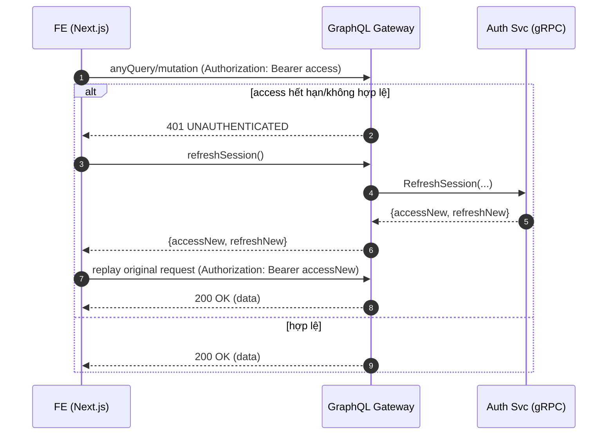

# 3. Auto-Retry Flow

## Overview

This document describes the automatic retry mechanism when access tokens expire, providing seamless user experience.

## Sequence Diagram



## Key Components

### Request Interception
- **HTTP Client**: Intercepts all GraphQL requests
- **Status Detection**: Identifies 401 Unauthorized responses
- **Automatic Retry**: Transparent to application code
- **Error Handling**: Graceful fallback on failure

### Token Management
- **Memory Storage**: Access tokens never persisted
- **Automatic Updates**: New tokens replace expired ones
- **Race Conditions**: Single refresh per session
- **Cleanup**: Clear tokens on logout/error

### User Experience
- **Seamless**: No visible interruption to user
- **Fast**: Sub-second token refresh
- **Reliable**: Fallback to login if refresh fails
- **Consistent**: Same behavior across all requests

## Implementation Details

### Frontend HTTP Client
```javascript
class AuthenticatedClient {
  async request(query, variables) {
    try {
      return await this.graphqlRequest(query, variables)
    } catch (error) {
      if (error.status === 401) {
        // Attempt token refresh
        const refreshed = await this.refreshToken()
        if (refreshed) {
          // Retry original request
          return await this.graphqlRequest(query, variables)
        } else {
          // Redirect to login
          this.redirectToLogin()
          throw new Error('Authentication required')
        }
      }
      throw error
    }
  }

  async refreshToken() {
    try {
      const response = await fetch('/graphql', {
        method: 'POST',
        credentials: 'include', // Include HttpOnly cookie
        body: JSON.stringify({
          query: 'mutation { refreshSession { accessToken } }'
        })
      })

      if (response.ok) {
        const { data } = await response.json()
        this.setAccessToken(data.refreshSession.accessToken)
        return true
      }
      return false
    } catch {
      return false
    }
  }
}
```

### Concurrent Request Handling
```javascript
class TokenManager {
  constructor() {
    this.refreshPromise = null
  }

  async ensureValidToken() {
    // Prevent multiple concurrent refresh attempts
    if (this.refreshPromise) {
      return await this.refreshPromise
    }

    if (this.isTokenExpired()) {
      this.refreshPromise = this.refreshToken()
      try {
        await this.refreshPromise
      } finally {
        this.refreshPromise = null
      }
    }
  }
}
```

## Error Scenarios

### Refresh Failure
- Network connectivity issues
- Refresh token expired/revoked
- Server-side authentication errors
- Security violations detected

### Fallback Behavior
```javascript
if (refreshFailed) {
  // Clear all authentication state
  this.clearTokens()
  this.clearCookies()

  // Redirect to login with return URL
  const returnUrl = encodeURIComponent(window.location.href)
  window.location.href = `/login?returnUrl=${returnUrl}`
}
```

### Race Condition Prevention
- Single refresh per session
- Queue pending requests during refresh
- Atomic token updates
- Consistent error handling

## Security Considerations

### Token Exposure
- Access tokens in memory only
- No token logging or debugging output
- Secure transmission over HTTPS
- Automatic cleanup on errors

### Retry Limits
- Maximum 1 retry per request
- No infinite retry loops
- Exponential backoff for failures
- Circuit breaker for repeated failures