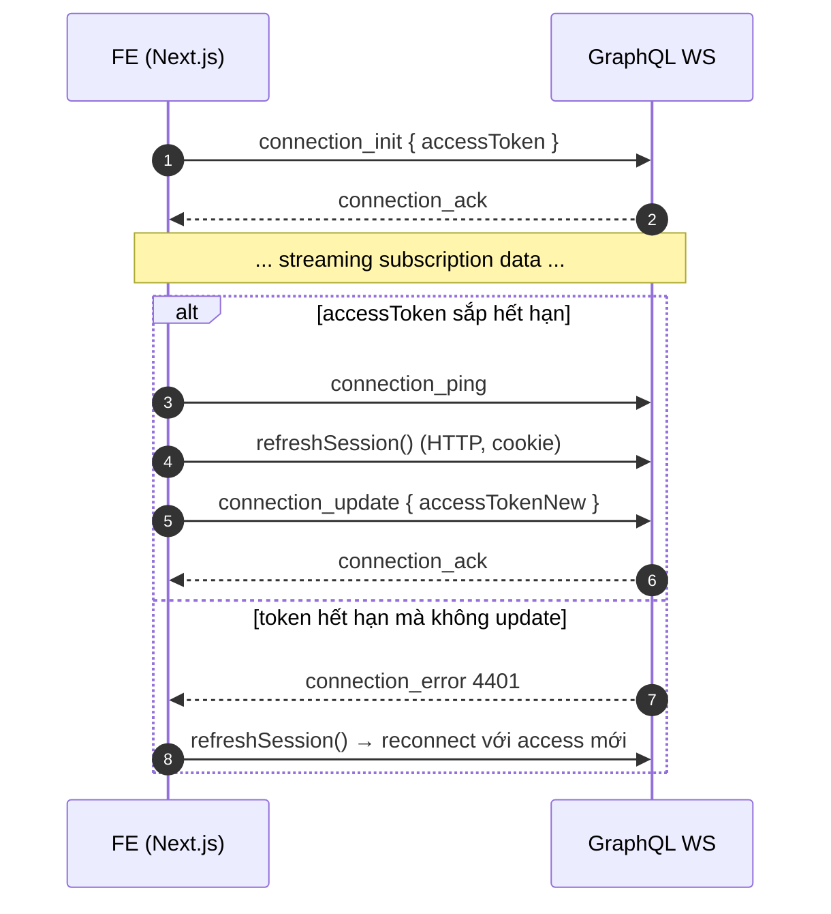

# 6. WebSocket Authentication Flow

## Overview

This document describes the WebSocket authentication flow for real-time connections, including connection initialization and token refresh.

## Sequence Diagram



## Key Components

### Connection Initialization
- **Token Transmission**: Access token in connection payload
- **Authentication**: Verify token before accepting connection
- **Context Setup**: Establish user context for subscriptions
- **Error Handling**: Reject invalid connections

### Token Management
- **Expiration Monitoring**: Track token expiration time
- **Proactive Refresh**: Refresh before expiration
- **Connection Update**: Send new token to maintain connection
- **Reconnection**: Fallback to full reconnect if needed

### Real-time Authentication
- **Persistent Connection**: Maintain authentication state
- **Dynamic Updates**: Update auth without disconnecting
- **Subscription Security**: Ensure user can access subscribed data
- **Connection Recovery**: Handle network interruptions

## Implementation Details

### WebSocket Connection Setup
```javascript
import { createClient } from 'graphql-ws'

class AuthenticatedWSClient {
  constructor() {
    this.accessToken = null
    this.client = null
  }

  connect() {
    this.client = createClient({
      url: 'wss://api.example.com/graphql',
      connectionParams: () => ({
        authorization: this.accessToken ? `Bearer ${this.accessToken}` : null
      }),
      on: {
        connected: () => {
          console.log('WebSocket connected')
        },
        error: (error) => {
          if (error.code === 4401) {
            this.handleAuthError()
          }
        }
      }
    })
  }

  async handleAuthError() {
    try {
      // Attempt token refresh
      const newToken = await this.refreshToken()
      if (newToken) {
        this.accessToken = newToken
        // Reconnect with new token
        this.reconnect()
      } else {
        // Redirect to login
        this.redirectToLogin()
      }
    } catch (error) {
      console.error('Token refresh failed:', error)
      this.redirectToLogin()
    }
  }

  subscribe(query, variables) {
    return this.client.subscribe({
      query,
      variables
    })
  }
}
```

### Server-Side Authentication
```javascript
import { useServer } from 'graphql-ws/lib/use/ws'

useServer({
  schema,
  context: async (ctx) => {
    // Get token from connection params
    const token = ctx.connectionParams?.authorization?.replace('Bearer ', '')

    if (!token) {
      throw new Error('Unauthorized')
    }

    try {
      // Verify access token
      const payload = await verifyAccessToken(token)
      return {
        userId: payload.userId,
        user: await getUserById(payload.userId)
      }
    } catch (error) {
      throw new Error('Invalid token')
    }
  },
  onConnect: async (ctx) => {
    // Validate connection on connect
    console.log('WebSocket connection established')
  },
  onDisconnect: (ctx) => {
    console.log('WebSocket connection closed')
  }
}, wsServer)
```

## Authentication Flow

### Initial Connection
```javascript
// Client connects with access token
const connectionParams = {
  authorization: `Bearer ${accessToken}`
}

// Server validates token and establishes context
const context = await validateToken(connectionParams.authorization)
```

### Token Refresh Pattern
```javascript
class TokenManager {
  constructor() {
    this.refreshTimer = null
  }

  startTokenMonitoring(expiresAt) {
    // Refresh 5 minutes before expiration
    const refreshTime = new Date(expiresAt).getTime() - Date.now() - (5 * 60 * 1000)

    this.refreshTimer = setTimeout(async () => {
      try {
        const newToken = await this.refreshAccessToken()
        this.updateWebSocketToken(newToken)
      } catch (error) {
        console.error('Token refresh failed:', error)
        this.handleAuthFailure()
      }
    }, refreshTime)
  }

  updateWebSocketToken(newToken) {
    // Update connection with new token
    this.wsClient.updateConnectionParams({
      authorization: `Bearer ${newToken}`
    })
  }
}
```

## Subscription Security

### Authorization Checks
```javascript
// Subscription resolver with auth
const resolvers = {
  Subscription: {
    mintStatus: {
      subscribe: withFilter(
        (_, __, context) => {
          // Check user authentication
          if (!context.userId) {
            throw new Error('Unauthorized')
          }
          return pubsub.asyncIterator(['MINT_STATUS'])
        },
        (payload, variables, context) => {
          // Check if user can access this specific data
          return payload.mintStatus.userId === context.userId
        }
      )
    }
  }
}
```

### Data Filtering
- **User-Specific**: Only send data user is authorized to see
- **Real-time Validation**: Check permissions on each message
- **Context Preservation**: Maintain user context throughout subscription
- **Error Handling**: Gracefully handle permission changes

## Error Handling

### Connection Errors
```javascript
const wsClient = createClient({
  url: 'wss://api.example.com/graphql',
  retryAttempts: 3,
  retryWait: async function* retries() {
    for (const [attempt, retry] of retries) {
      await new Promise(resolve => setTimeout(resolve, 2 ** attempt * 1000))
      yield retry
    }
  },
  on: {
    error: (error) => {
      if (error.code === 4401) {
        // Unauthorized - attempt token refresh
        handleAuthError()
      } else if (error.code === 4403) {
        // Forbidden - redirect to login
        redirectToLogin()
      }
    }
  }
})
```

### Network Interruptions
- **Automatic Reconnection**: Retry connection with exponential backoff
- **State Recovery**: Restore subscriptions after reconnection
- **Token Validation**: Refresh token if expired during disconnection
- **User Notification**: Inform user of connection status

### Security Violations
- **Immediate Disconnection**: Close connection on security breach
- **Audit Logging**: Record security violations
- **Rate Limiting**: Prevent connection abuse
- **IP Blocking**: Block malicious IP addresses