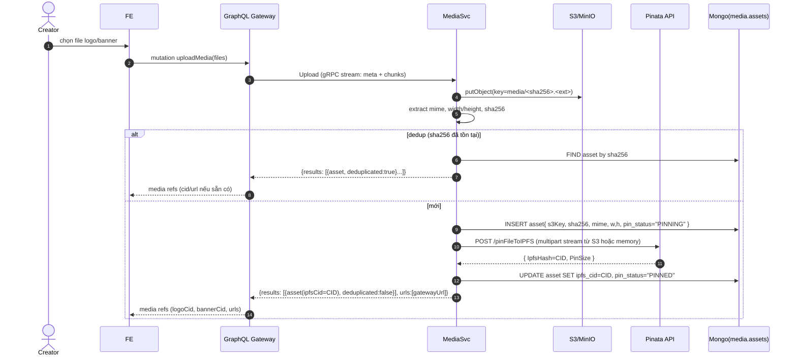
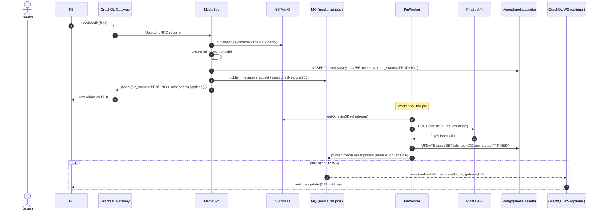

# 1. Media Upload Flow

## Overview

This document describes the media upload flow for collection creation, covering file upload to S3/IPFS and metadata storage.

## Sequence Diagram - Synchronous Upload



## Sequence Diagram - Asynchronous Upload



## Key Components

### Media Service
- Handles multiple file formats (images, videos, audio)
- Generates thumbnails and variants automatically
- Stores original files in S3 or pins to IPFS
- Creates optimized versions for web delivery

### Storage Backend
- **S3**: Primary storage for media files
- **IPFS**: Decentralized storage option
- **CDN**: Content delivery network for fast access
- **Variants**: Multiple sizes/formats for optimization

### Media Processing
- Image resizing and compression
- Video transcoding and thumbnails
- Audio waveform generation
- Format conversion and optimization

## Data Flow

1. **File Selection**: User selects logo and banner files
2. **Upload Request**: Frontend sends files to GraphQL
3. **Processing**: Media service processes and stores files
4. **Storage**: Files saved to S3/IPFS with metadata
5. **Response**: Returns content identifiers and URLs

## File Types Supported

### Images
- **Formats**: PNG, JPG, GIF, WebP, SVG
- **Max Size**: 10MB per file
- **Variants**: Thumbnail, medium, large, original
- **Optimization**: Compression and format conversion

### Videos
- **Formats**: MP4, WebM, MOV
- **Max Size**: 100MB per file
- **Processing**: Thumbnail extraction, compression
- **Streaming**: Adaptive bitrate for large files

### Audio
- **Formats**: MP3, WAV, OGG
- **Max Size**: 50MB per file
- **Processing**: Waveform generation, compression
- **Metadata**: Duration, bitrate, artist info

## Media Metadata Structure

```json
{
  "_id": "media_asset_id",
  "cid": "QmHash...",
  "kind": "image|video|audio",
  "source": "upload|generated",
  "mime": "image/png",
  "bytes": 1024000,
  "width": 1920,
  "height": 1080,
  "s3Key": "collections/logos/...",
  "ipfsCid": "QmHash...",
  "sha256": "hash...",
  "phash": "perceptual_hash",
  "moderation": "approved|pending|rejected",
  "exif": {...},
  "createdAt": "2024-01-01T00:00:00Z"
}
```

## Error Handling

### Upload Failures
- Network interruption during upload
- File size or format validation errors
- Storage backend unavailability
- Retry logic with exponential backoff

### Processing Errors
- Unsupported file formats
- Corrupted file data
- Processing timeout
- Fallback to original file

### Storage Issues
- S3 bucket permissions
- IPFS pinning failures
- CDN synchronization delays
- Backup storage options