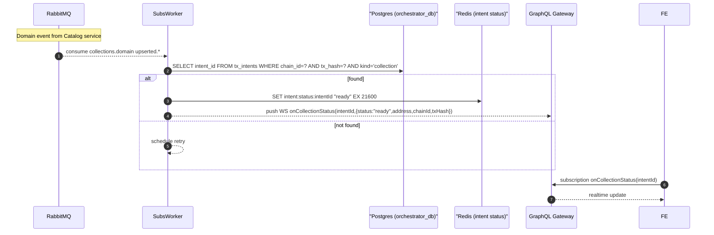

# 5. Collection Completion Flow

## Overview

This document describes the collection completion flow, covering intent resolution and real-time notifications to users.

## Sequence Diagram



## Key Components

### Subscription Worker
- Consumes collection domain events
- Links blockchain events to user intents
- Updates intent status in Redis
- Sends real-time notifications

### Intent Resolution
- Matches events to intents by transaction hash
- Updates status from "pending" to "ready"
- Maintains 6-hour cache TTL
- Handles retry logic for unmatched events

### WebSocket Notifications
- Real-time status updates to frontend
- Collection address and metadata
- Transaction confirmation details
- Error reporting and retry status

## Intent Lifecycle

### Status Transitions
```
pending → broadcast → confirmed → indexed → ready
   ↓           ↓           ↓         ↓
 failed     failed     failed    failed
```

### Status Descriptions
- **pending**: Intent created, awaiting user action
- **broadcast**: Transaction sent to blockchain
- **confirmed**: Transaction confirmed on blockchain
- **indexed**: Collection detected by indexer
- **ready**: Collection available in catalog
- **failed**: Process failed at any stage

## Real-time Updates

### WebSocket Subscription
```graphql
subscription onCollectionStatus($intentId: String!) {
  onCollectionStatus(intentId: $intentId) {
    status
    collectionAddress
    chainId
    txHash
    error
    metadata {
      name
      symbol
      deployedAt
    }
  }
}
```

### Update Payload
```json
{
  "status": "ready",
  "collectionAddress": "0x1234...",
  "chainId": "eip155:1",
  "txHash": "0xabcd...",
  "metadata": {
    "name": "My Collection",
    "symbol": "MC",
    "deployedAt": "2024-01-01T12:00:00Z"
  }
}
```

## Collection Availability

### Catalog Integration
- Collection indexed and searchable
- Media assets processed and available
- Metadata normalized and cached
- Marketplace features enabled

### Collection Features
```json
{
  "collection": {
    "id": "uuid-v4",
    "name": "My Collection",
    "symbol": "MC",
    "address": "0x1234...",
    "chainId": "eip155:1",
    "creator": "0x5678...",
    "totalSupply": 0,
    "mintable": true,
    "tradeable": true,
    "royaltyBps": 250,
    "metadata": {
      "description": "...",
      "image": "ipfs://...",
      "banner": "ipfs://...",
      "website": "https://...",
      "social": {...}
    }
  }
}
```

## Error Handling

### Intent Not Found
```javascript
// Retry logic for unmatched events
const retryDelay = Math.min(1000 * Math.pow(2, attempt), 30000)
setTimeout(() => {
    processCollectionEvent(event)
}, retryDelay)
```

### WebSocket Failures
- Connection retry with exponential backoff
- Message queuing during disconnection
- State synchronization on reconnect
- Fallback to polling if WebSocket fails

### Status Recovery
```javascript
// Frontend polling fallback
const pollIntentStatus = async (intentId) => {
    try {
        const response = await query(GET_INTENT_STATUS, { intentId })
        return response.data.intentStatus
    } catch (error) {
        console.error('Status polling failed:', error)
        return null
    }
}
```

## Post-Creation Actions

### Collection Management
- Update collection metadata
- Configure mint settings
- Set access permissions
- Enable marketplace features

### User Notifications
- Email notification of successful creation
- Dashboard update with new collection
- Social media sharing options
- Analytics tracking setup

### Integration Points
- Marketplace listing preparation
- Third-party API webhooks
- Analytics event tracking
- Search index updates

## Monitoring & Analytics

### Metrics Tracking
- Intent completion rate
- Average processing time
- Failure points and causes
- User engagement metrics

### Alerting
- Failed intent resolution
- Processing delays
- High error rates
- System performance issues