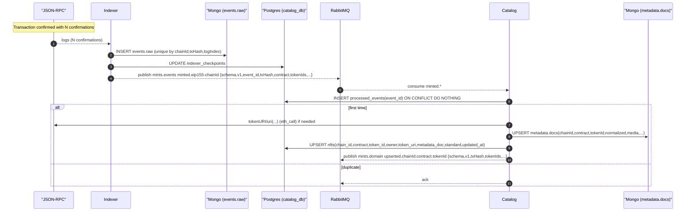

# 4. Event Processing Flow

## Overview

This document describes the event processing flow for NFT minting, covering blockchain event indexing and catalog updates.

## Sequence Diagram



## Key Components

### Indexer Service
- Monitors blockchain for confirmed events
- Stores raw events in MongoDB
- Updates checkpoint tracking
- Publishes structured events to message queue

### Event Storage
- **Raw Events**: Complete blockchain event data
- **Checkpoints**: Track last processed block per chain
- **Deduplication**: Unique constraint on chainId+txHash+logIndex
- **Reliability**: Ensures no events are missed

### Message Queue Integration
- **Topic**: `mints.events`
- **Routing Key**: `minted.eip155-{chainId}`
- **Schema**: Versioned event structure
- **Durability**: Persistent message storage

### Catalog Processing
- Consumes mint events from queue
- Fetches token metadata from blockchain
- Normalizes metadata structure
- Updates catalog database

## Event Processing Pipeline

### 1. Event Detection
- Indexer polls blockchain for new events
- Filters for relevant contract addresses
- Waits for required confirmations
- Batches events for efficiency

### 2. Raw Storage
- Store complete event data in MongoDB
- Include block number, transaction hash, log index
- Preserve original event structure
- Enable event replay if needed

### 3. Checkpoint Update
- Track last processed block per chain
- Atomic update with event storage
- Resume processing from checkpoint
- Handle chain reorganizations

### 4. Message Publishing
- Transform raw events to structured format
- Include relevant metadata and context
- Route to appropriate topic/queue
- Ensure delivery guarantees

### 5. Catalog Update
- Process events idempotently
- Fetch additional metadata if needed
- Update normalized NFT records
- Trigger downstream notifications

## Metadata Processing

### Token URI Fetching
```javascript
// For ERC-721
const tokenURI = await contract.tokenURI(tokenId)

// For ERC-1155
const uri = await contract.uri(tokenId)
```

### Metadata Normalization
- Fetch JSON from token URI
- Extract standard fields (name, description, image)
- Process media URLs and IPFS content
- Store in standardized format

### Error Handling
- Retry failed metadata fetches
- Handle invalid JSON responses
- Log metadata fetch failures
- Continue processing other tokens

## Idempotency

### Event Deduplication
- Check `processed_events` table before processing
- Use `ON CONFLICT DO NOTHING` pattern
- Prevent duplicate catalog updates
- Enable safe event replay

### Retry Logic
- Exponential backoff for failures
- Dead letter queue for permanent failures
- Manual retry capabilities
- Monitoring and alerting