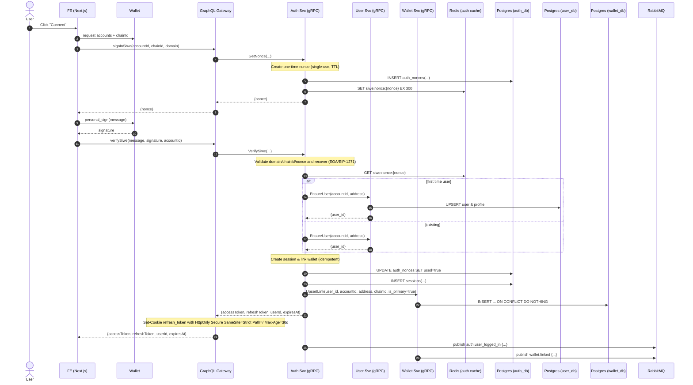

# 1. SIWE Sign-In Flow

## Overview

This document describes the complete Sign-In with Ethereum (SIWE) flow, including nonce generation, signature verification, and session creation.

## Sequence Diagram



## Key Components

### SIWE Message Format
```
app.zuno.com wants you to sign in with your Ethereum account:
0x1234567890123456789012345678901234567890

I accept the Terms of Service: https://app.zuno.com/tos

URI: https://app.zuno.com
Version: 1
Chain ID: 1
Nonce: 32AlphaNumericChars
Issued At: 2024-01-01T12:00:00.000Z
```

### Nonce Generation
- **Format**: 32 character alphanumeric string
- **TTL**: 5 minutes (300 seconds)
- **Single Use**: Marked as used after verification
- **Storage**: Both PostgreSQL and Redis for reliability

### Signature Verification
- **EOA**: Standard ECDSA signature recovery
- **Smart Contracts**: EIP-1271 signature validation
- **Domain Binding**: Prevents signature replay attacks
- **Nonce Validation**: Ensures freshness and single use

## GraphQL Schema

```graphql
scalar Address
scalar ChainId
scalar Hex
scalar DateTime

type NoncePayload {
  nonce: String!
}

type AuthPayload {
  accessToken: String!
  refreshToken: String!
  expiresAt: DateTime!
  userId: ID!
}

input SignInSiweInput {
  accountId: String!
  chainId: ChainId!
  domain: String!
}

input VerifySiweInput {
  accountId: String!
  message: String!
  signature: Hex!
}

type Mutation {
  signInSiwe(input: SignInSiweInput!): NoncePayload!
  verifySiwe(input: VerifySiweInput!): AuthPayload!
}
```

## Security Features

### Nonce Protection
- Cryptographically secure random generation
- One-time use prevents replay attacks
- Short TTL limits attack window
- Database tracking for audit trails

### Session Security
- HttpOnly cookies prevent XSS access
- Secure flag for HTTPS-only transmission
- SameSite=Strict prevents CSRF
- 30-day refresh token rotation

### Wallet Linking
- Idempotent operations prevent duplicates
- Primary wallet designation
- Multi-chain address support
- Automatic profile creation