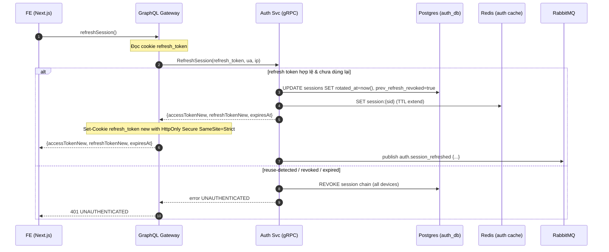

# 2. Session Refresh Flow

## Overview

This document describes the session refresh flow for maintaining authentication state using refresh token rotation.

## Sequence Diagram



## Key Components

### Refresh Token Rotation
- **New Token**: Generated on each refresh
- **Old Token**: Immediately invalidated
- **Reuse Detection**: Revokes entire session chain
- **Secure Storage**: HttpOnly cookie only

### Session Management
- **TTL Extension**: Redis cache extended on refresh
- **Chain Revocation**: All devices logged out on compromise
- **Audit Trail**: Track refresh attempts and sources
- **Rate Limiting**: Prevent refresh token abuse

### Security Features
- **Automatic Rotation**: Prevents token theft
- **Immediate Invalidation**: Old tokens unusable
- **Compromise Detection**: Reuse triggers security response
- **Device Tracking**: User agent and IP logging

## Error Scenarios

### Token Reuse Detection
```javascript
// If refresh token is used more than once
if (refreshToken.used) {
  // Revoke all sessions for this user
  await revokeAllUserSessions(userId)
  throw new Error('SECURITY_VIOLATION: Token reuse detected')
}
```

### Expired Tokens
- Natural expiration after 30 days
- Graceful degradation to login
- Clear security cookie
- Return to unauthenticated state

### Invalid Tokens
- Malformed or tampered tokens
- Unknown session references
- Database inconsistencies
- Immediate session termination

## Frontend Integration

### Automatic Refresh
```javascript
// Intercept 401 responses
if (response.status === 401) {
  const refreshResult = await refreshSession()
  if (refreshResult.success) {
    // Retry original request with new token
    return retryWithNewToken(originalRequest)
  } else {
    // Redirect to login
    redirectToLogin()
  }
}
```

### Token Storage
- Access tokens in memory only
- Refresh tokens in HttpOnly cookies
- No localStorage/sessionStorage usage
- Automatic cleanup on logout