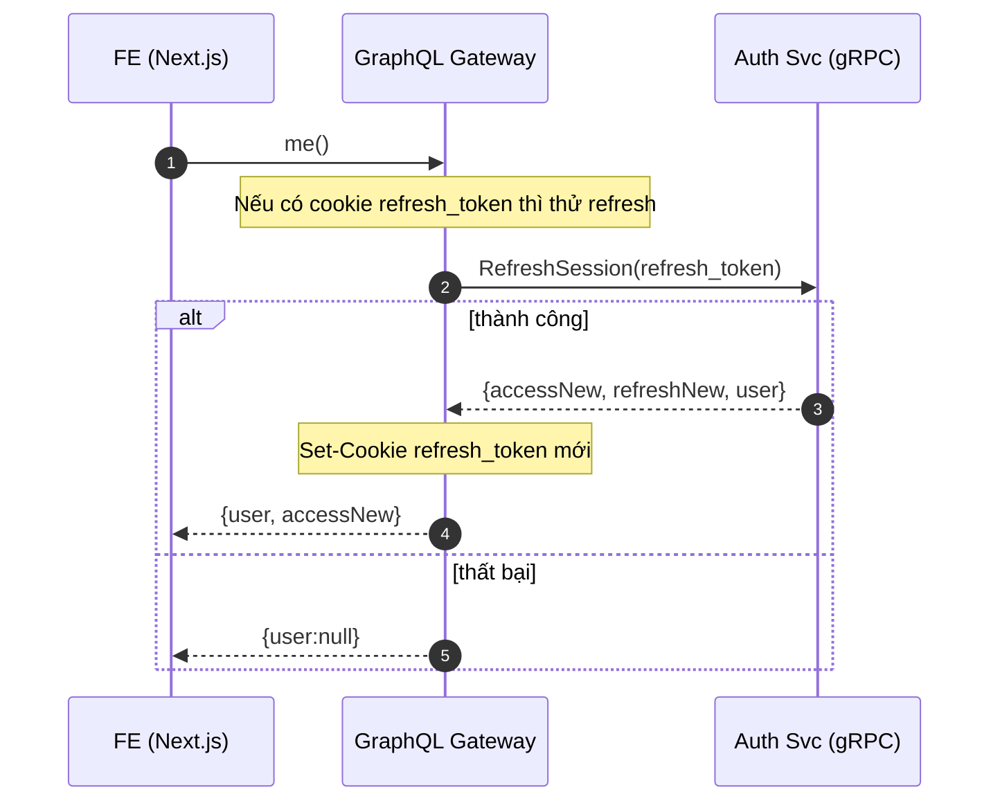

# 4. Silent Session Restore Flow

## Overview

This document describes the silent session restore mechanism that automatically authenticates users when the application loads.

## Sequence Diagram



## Key Components

### Application Bootstrap
- **Page Load**: Triggered on application startup
- **Cookie Detection**: Checks for refresh token cookie
- **Silent Operation**: No user interaction required
- **Graceful Degradation**: Falls back to unauthenticated state

### Session Restoration
- **Token Refresh**: Uses existing refresh token
- **User Data**: Fetches current user profile
- **State Initialization**: Sets up authentication context
- **UI Updates**: Shows authenticated interface

### User Experience
- **Instant Login**: No need to re-authenticate
- **Persistent Sessions**: Survive browser restarts
- **Smooth Loading**: Seamless transition to authenticated state
- **Progressive Enhancement**: Works without JavaScript

## Implementation Details

### Frontend Application Startup
```javascript
// App initialization
export default function App({ Component, pageProps }) {
  const [user, setUser] = useState(null)
  const [loading, setLoading] = useState(true)

  useEffect(() => {
    initializeAuth()
  }, [])

  async function initializeAuth() {
    try {
      const response = await graphql(`
        query Me {
          me {
            id
            profile {
              username
              displayName
              avatar
            }
            wallets {
              address
              chainId
              isPrimary
            }
          }
        }
      `)

      if (response.data.me) {
        setUser(response.data.me)
      }
    } catch (error) {
      // User not authenticated, show login
      console.log('Not authenticated')
    } finally {
      setLoading(false)
    }
  }

  if (loading) {
    return <LoadingSpinner />
  }

  return (
    <AuthContext.Provider value={{ user, setUser }}>
      <Component {...pageProps} />
    </AuthContext.Provider>
  )
}
```

### GraphQL Resolver
```javascript
// me query resolver
async me(parent, args, context) {
  // Check for refresh token in cookies
  const refreshToken = context.req.cookies.refresh_token

  if (!refreshToken) {
    return null
  }

  try {
    // Attempt silent refresh
    const authResult = await context.auth.refreshSession({
      refreshToken,
      userAgent: context.req.headers['user-agent'],
      ipAddress: context.req.ip
    })

    // Set new refresh token cookie
    context.res.cookie('refresh_token', authResult.refreshToken, {
      httpOnly: true,
      secure: true,
      sameSite: 'strict',
      maxAge: 30 * 24 * 60 * 60 * 1000 // 30 days
    })

    // Return user data with new access token
    const user = await context.user.getById(authResult.userId)
    context.accessToken = authResult.accessToken

    return user
  } catch (error) {
    // Clear invalid cookie
    context.res.clearCookie('refresh_token')
    return null
  }
}
```

## Security Considerations

### Cookie Security
- **HttpOnly**: Prevents JavaScript access
- **Secure**: HTTPS-only transmission
- **SameSite**: CSRF protection
- **Domain Scoped**: Limited to application domain

### Token Validation
- **Signature Verification**: Cryptographic validation
- **Expiration Check**: Time-based validation
- **Revocation Check**: Database lookup for active sessions
- **Rate Limiting**: Prevent abuse of refresh endpoint

### Privacy Protection
- **No Tracking**: Session restore doesn't create logs
- **Minimal Data**: Only necessary user information
- **Opt-out**: Users can clear cookies to logout
- **Transparency**: Clear privacy policy

## Error Handling

### Invalid Refresh Token
```javascript
if (refreshTokenInvalid) {
  // Clear the invalid cookie
  res.clearCookie('refresh_token', {
    httpOnly: true,
    secure: true,
    sameSite: 'strict'
  })

  // Return unauthenticated state
  return null
}
```

### Network Failures
- **Timeout Handling**: Graceful degradation
- **Retry Logic**: Limited retry attempts
- **Offline Support**: Cache user data when possible
- **Error Reporting**: Log critical failures

### Browser Compatibility
- **Cookie Support**: Fallback for disabled cookies
- **JavaScript Required**: Progressive enhancement
- **HTTPS Required**: Secure cookie transmission
- **Modern Browsers**: ES6+ features used