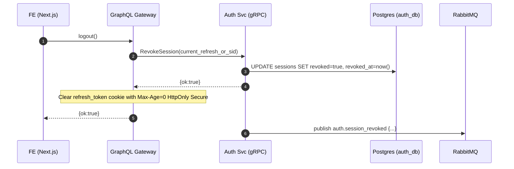

# 5. Logout Flow

## Overview

This document describes the logout flow for terminating user sessions and clearing authentication state.

## Sequence Diagram



## Key Components

### Session Revocation
- **Database Update**: Mark session as revoked
- **Immediate Effect**: Session invalid for future requests
- **Audit Trail**: Record logout timestamp and reason
- **Cleanup**: Remove cached session data

### Cookie Management
- **Clear Cookie**: Set Max-Age=0 to delete
- **Security Flags**: Maintain HttpOnly and Secure
- **Domain Scope**: Clear from correct domain
- **Path Matching**: Ensure complete removal

### Event Publishing
- **Audit Events**: Log logout for security monitoring
- **Analytics**: Track user session patterns
- **Integrations**: Notify other services of logout
- **Cleanup Jobs**: Trigger background cleanup tasks

## Implementation Details

### Frontend Logout
```javascript
async function logout() {
  try {
    // Call logout mutation
    await graphql(`
      mutation Logout {
        logout {
          success
        }
      }
    `)

    // Clear client-side state
    clearAccessToken()
    clearUserData()

    // Redirect to home page
    router.push('/')

    // Show logout confirmation
    showNotification('Successfully logged out')
  } catch (error) {
    // Handle logout errors gracefully
    console.error('Logout failed:', error)

    // Still clear client state
    clearAccessToken()
    clearUserData()
  }
}
```

### GraphQL Resolver
```javascript
async logout(parent, args, context) {
  try {
    // Get refresh token from cookie
    const refreshToken = context.req.cookies.refresh_token

    if (refreshToken) {
      // Revoke the session
      await context.auth.revokeSession({
        refreshToken,
        reason: 'USER_LOGOUT',
        userAgent: context.req.headers['user-agent'],
        ipAddress: context.req.ip
      })
    }

    // Clear the refresh token cookie
    context.res.cookie('refresh_token', '', {
      httpOnly: true,
      secure: true,
      sameSite: 'strict',
      maxAge: 0,
      path: '/'
    })

    return { success: true }
  } catch (error) {
    // Log error but still clear cookie
    console.error('Logout error:', error)

    context.res.cookie('refresh_token', '', {
      httpOnly: true,
      secure: true,
      sameSite: 'strict',
      maxAge: 0,
      path: '/'
    })

    return { success: true }
  }
}
```

## Logout Types

### User-Initiated Logout
- **Explicit Action**: User clicks logout button
- **Graceful Process**: Normal logout flow
- **Confirmation**: Optional logout confirmation
- **Redirect**: Navigate to public page

### Automatic Logout
- **Session Timeout**: After inactivity period
- **Security Event**: Suspicious activity detected
- **Token Compromise**: Refresh token reuse
- **Admin Action**: Force logout by administrator

### Device-Specific Logout
- **Current Device**: Logout from current session only
- **All Devices**: Revoke all user sessions
- **Selective**: Choose which devices to logout
- **Remote Logout**: Logout other devices

## Security Features

### Session Cleanup
```javascript
async function revokeSession(sessionId, reason) {
  // Update database
  await db.query(`
    UPDATE sessions
    SET
      revoked = true,
      revoked_at = NOW(),
      revoked_reason = $2
    WHERE session_id = $1
  `, [sessionId, reason])

  // Clear Redis cache
  await redis.del(`session:${sessionId}`)

  // Publish security event
  await messageQueue.publish('auth.session_revoked', {
    sessionId,
    reason,
    timestamp: new Date().toISOString()
  })
}
```

### Token Blacklisting
- **Immediate Invalidation**: Tokens unusable immediately
- **Cache Updates**: Clear all cached session data
- **Propagation**: Notify all service instances
- **Cleanup**: Remove expired blacklist entries

### Audit Logging
```javascript
const logoutEvent = {
  userId: session.userId,
  sessionId: session.id,
  action: 'LOGOUT',
  reason: 'USER_INITIATED',
  userAgent: req.headers['user-agent'],
  ipAddress: req.ip,
  timestamp: new Date().toISOString()
}

await auditLogger.log(logoutEvent)
```

## Error Handling

### Network Failures
- **Client Retry**: Retry logout request
- **Local Cleanup**: Clear client state regardless
- **Background Sync**: Sync logout when connection restored
- **User Feedback**: Inform user of logout status

### Server Errors
- **Graceful Degradation**: Clear cookies even on error
- **Error Logging**: Record server-side failures
- **Monitoring**: Alert on high logout failure rates
- **Recovery**: Manual session cleanup procedures

### Partial Failures
- **Cookie Clearing**: Always clear refresh token
- **Database Cleanup**: Retry session revocation
- **Cache Invalidation**: Ensure Redis cleanup
- **Event Publishing**: Retry audit events