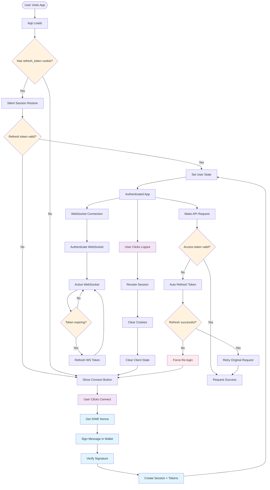
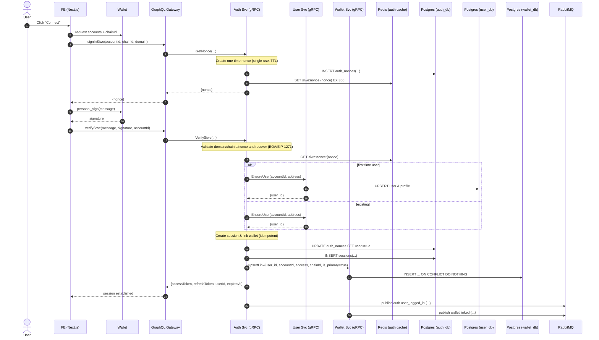

# Authentication Workflow - Complete SIWE Implementation

## Complete Authentication Flow



## Individual Authentication Sequences



## GraphQL Schema

```graphql
scalar Address
scalar ChainId
scalar Hex
scalar DateTime

type NoncePayload {
  nonce: String!
}

type AuthPayload {
  accessToken: String!
  refreshToken: String! # hoặc bỏ khỏi body và set cookie httpOnly
  expiresAt: DateTime!
  userId: ID!
}

input SignInSiweInput {
  accountId: String!
  chainId: ChainId!
  domain: String!
}

input VerifySiweInput {
  accountId: String!
  message: String!
  signature: Hex!
}

type Mutation {
  signInSiwe(input: SignInSiweInput!): NoncePayload!
  verifySiwe(input: VerifySiweInput!): AuthPayload!
}
```

## gRPC Services

### Auth Service

```proto
syntax = "proto3";
package auth.v1;
option go_package = "github.com/yourorg/packages/proto-gen-go/auth/v1;authv1";

message GetNonceRequest { string account_id = 1; string chain_id = 2; string domain = 3; }
message GetNonceResponse { string nonce = 1; }

message VerifySiweRequest { string account_id = 1; string message = 2; string signature = 3; }
message VerifySiweResponse {
  string access_token  = 1;
  string refresh_token = 2;
  string expires_at    = 3;
  string user_id       = 4;
  string address       = 5;
  string chain_id      = 6;
}

service Auth {
  rpc GetNonce(GetNonceRequest) returns (GetNonceResponse);
  rpc VerifySiwe(VerifySiweRequest) returns (VerifySiweResponse);
}
```

### Wallet Service

```proto
syntax = "proto3";
package wallets.v1;
option go_package = "github.com/yourorg/packages/proto-gen-go/wallets/v1;walletsv1";

message UpsertLinkRequest {
  string user_id   = 1;
  string account_id= 2;
  string address   = 3; // lowercase 0x…
  string chain_id  = 4; // CAIP-2
  bool   is_primary= 5;
}
message UpsertLinkResponse {}

service Wallets {
  rpc UpsertLink (UpsertLinkRequest) returns (UpsertLinkResponse);
}
```