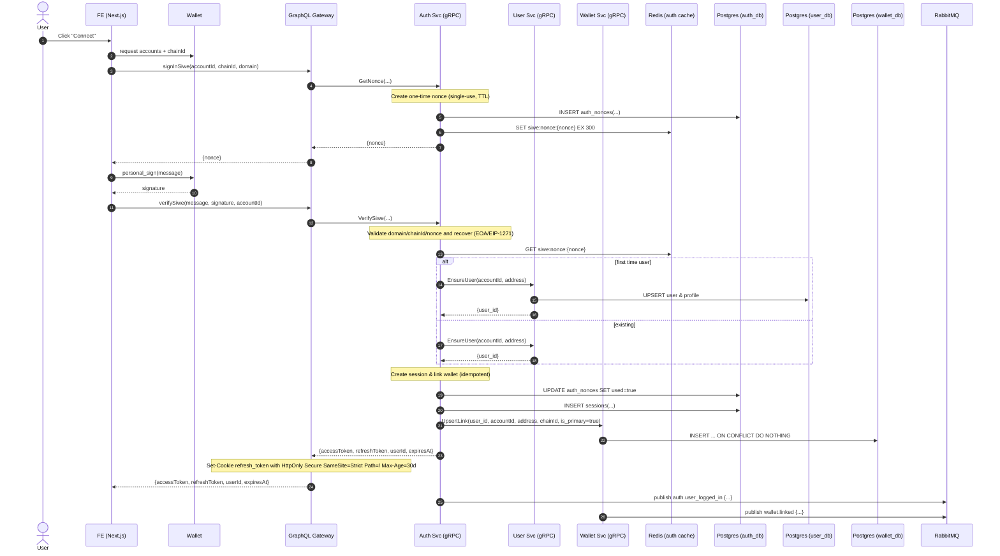
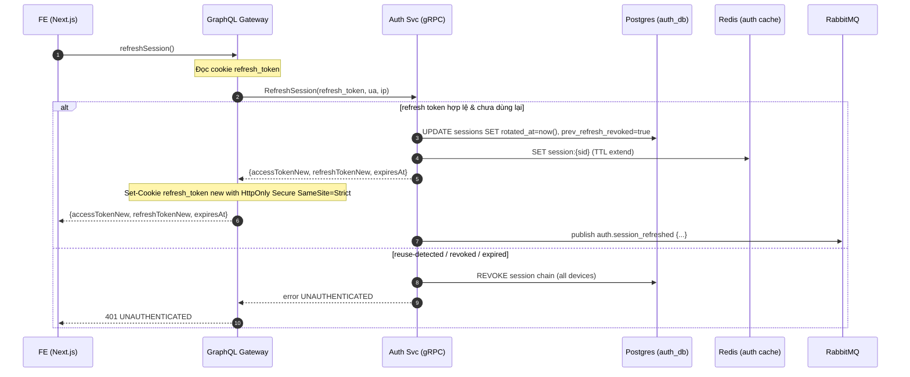
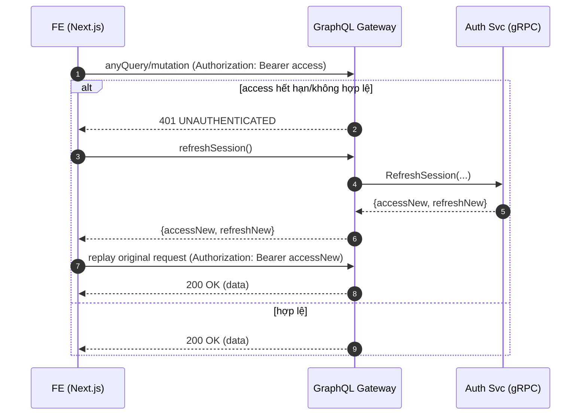
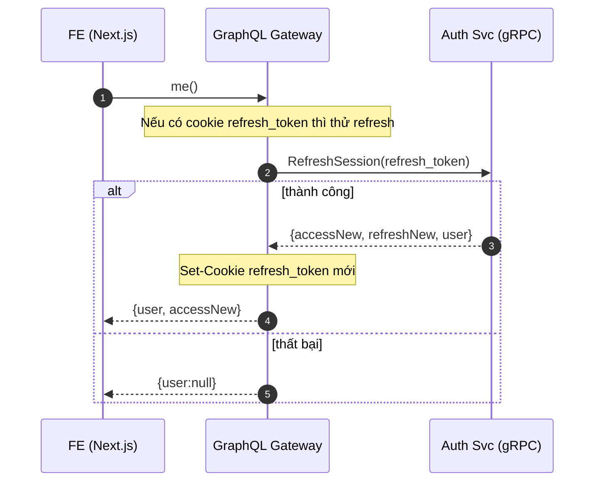
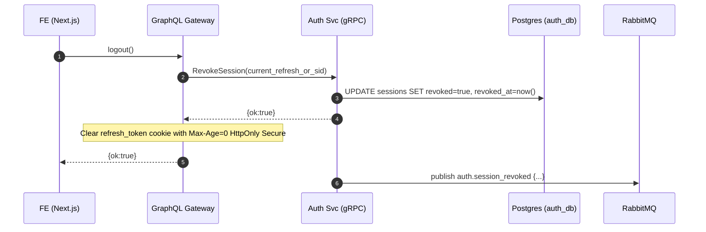
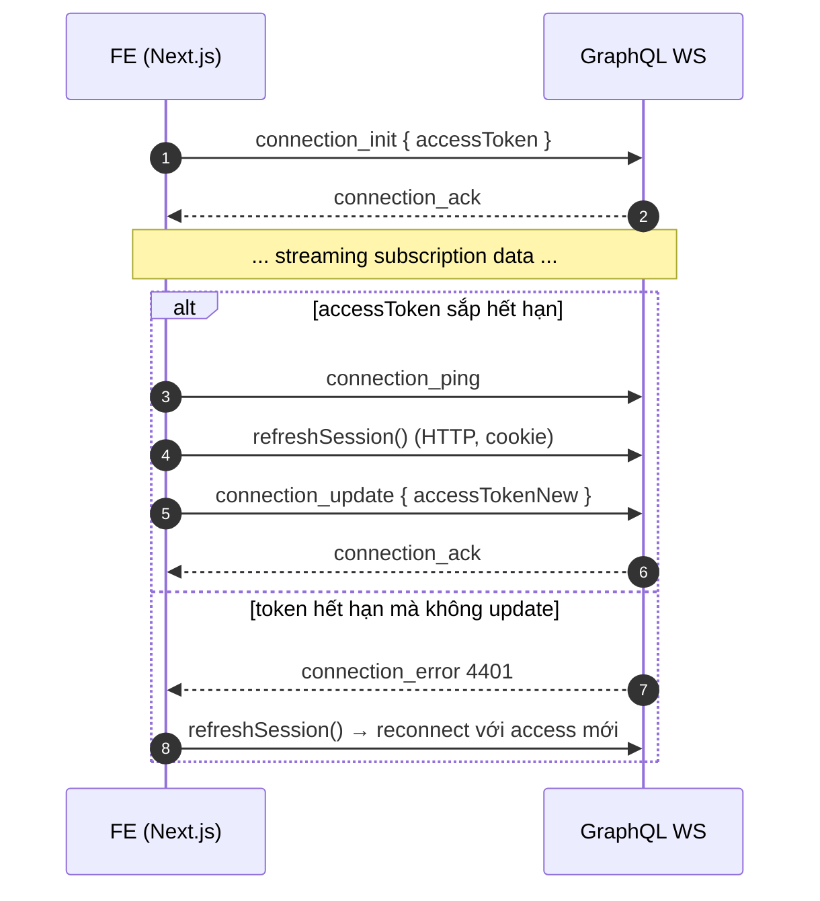

## 1. Sign-in (SIWE) hoàn chỉnh + Set-Cookie tại GQL

## 2. Refresh Session

## 3. Auto-retry khi access hết hạn (401 → refresh → replay)

## 4. Silent session restore khi app load

## 5. Logout

## 6. (WS) re-auth khi access hết hạn

