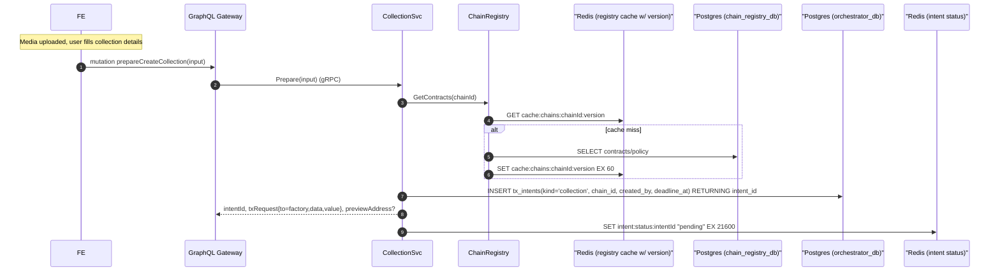
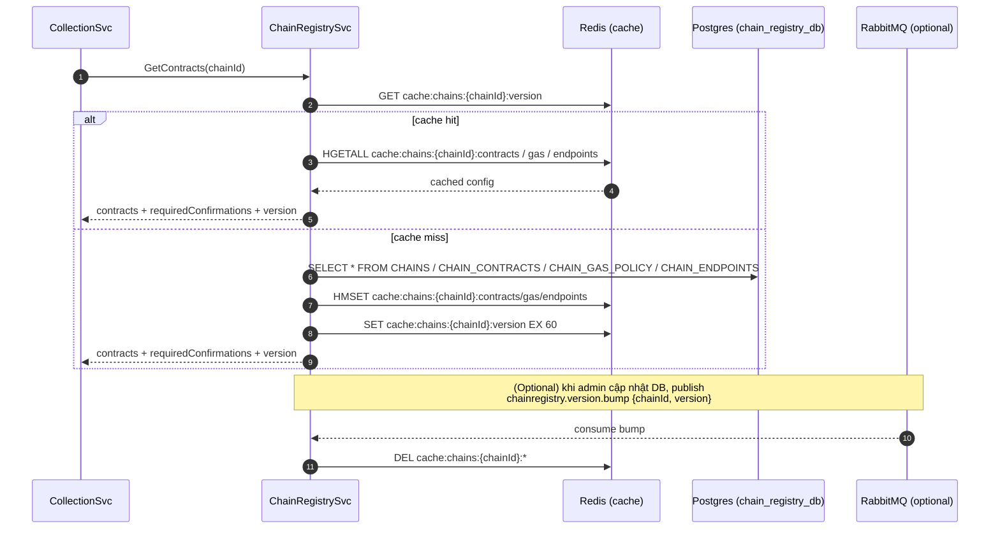

# 2. Collection Preparation Flow

## Overview

This document describes the collection preparation flow, covering validation, contract configuration, and intent creation.

## Sequence Diagram



## Key Components

### Collection Validation
- Name and symbol uniqueness check
- Metadata completeness validation
- Royalty percentage limits (0-10%)
- Media reference verification

### Chain Registry Integration
- Fetches factory contract addresses
- Retrieves gas policies and limits
- Validates chain support
- Caches configuration for performance

#### Chain Registry Caching Flow


### Contract Configuration
- **Factory Address**: Contract that deploys collections
- **Implementation**: Base contract template
- **Gas Policy**: Dynamic gas pricing strategy
- **Feature Support**: Chain-specific capabilities

## Input Validation

### Required Fields
```json
{
  "name": "Collection Name",
  "symbol": "SYMBOL",
  "description": "Collection description",
  "chainId": "eip155:1",
  "logoCid": "QmHash...",
  "bannerCid": "QmHash...",
  "royaltyBps": 250,
  "royaltyReceiver": "0x..."
}
```

### Optional Fields
```json
{
  "website": "https://example.com",
  "twitter": "@username",
  "discord": "https://discord.gg/...",
  "maxSupply": 10000,
  "mintPrice": "0.1",
  "category": "art|gaming|music|..."
}
```

## Contract Data Preparation

### Factory Call Data
```solidity
function createCollection(
    string memory name,
    string memory symbol,
    string memory baseURI,
    uint96 royaltyBps,
    address royaltyReceiver,
    bytes memory initData
) external returns (address collection)
```

### Init Data Structure
- Collection metadata URI
- Mint configuration
- Access control settings
- Feature flags

## Intent Management

### Intent Record
```sql
INSERT INTO tx_intents (
    intent_id,
    kind,
    chain_id,
    created_by,
    req_payload_json,
    deadline_at,
    status
) VALUES (
    uuid_generate_v4(),
    'collection',
    'eip155:1',
    'user_id',
    '{"name":"...","symbol":"..."}',
    NOW() + INTERVAL '6 hours',
    'pending'
)
```

### Status Tracking
- **pending**: Intent created, awaiting transaction
- **broadcast**: Transaction sent to blockchain
- **confirmed**: Factory contract called successfully
- **indexed**: Collection detected by indexer
- **ready**: Collection available in catalog

## Preview Address

### Deterministic Deployment
- Calculate collection address before deployment
- Use CREATE2 opcode for predictable addresses
- Enable frontend preview and linking
- Validate address uniqueness

### Address Calculation
```solidity
bytes32 salt = keccak256(abi.encodePacked(creator, nonce));
address predicted = Clones.predictDeterministicAddress(
    implementation,
    salt,
    factory
);
```

## Error Scenarios

### Validation Failures
- Invalid chain ID or unsupported network
- Duplicate collection name/symbol
- Invalid royalty configuration
- Missing required media assets

### Registry Issues
- Chain configuration not found
- Factory contract not deployed
- Gas policy outdated
- Network connectivity problems

### Intent Creation Failures
- Database connection issues
- Intent deadline conflicts
- User permission errors
- Storage quota exceeded