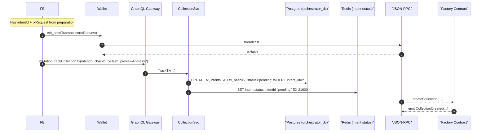

# 3. Contract Deployment Flow

## Overview

This document describes the contract deployment flow for collections, covering wallet interaction and factory contract execution.

## Sequence Diagram



## Key Components

### Wallet Integration
- Supports multiple wallet providers
- Handles transaction signing securely
- Manages gas estimation and pricing
- Provides user-friendly error messages

### Factory Contract
- Deploys new collection contracts
- Configures initial settings
- Emits creation events
- Manages implementation upgrades

### Transaction Tracking
- Links transaction hash to intent
- Updates status in real-time
- Monitors confirmation progress
- Handles failure scenarios

## Contract Deployment Process

### Factory Contract Call
```solidity
function createCollection(
    string memory name,
    string memory symbol,
    string memory baseURI,
    uint96 royaltyBps,
    address royaltyReceiver,
    bytes memory initData
) external returns (address collection) {
    // Deploy new collection contract
    collection = Clones.cloneDeterministic(
        implementation,
        _getSalt(msg.sender, nonce)
    );

    // Initialize collection
    ICollection(collection).initialize(
        name,
        symbol,
        baseURI,
        royaltyBps,
        royaltyReceiver,
        initData
    );

    // Emit creation event
    emit CollectionCreated(
        collection,
        msg.sender,
        name,
        symbol,
        block.timestamp
    );

    return collection;
}
```

### Collection Initialization
```solidity
function initialize(
    string memory name,
    string memory symbol,
    string memory baseURI,
    uint96 royaltyBps,
    address royaltyReceiver,
    bytes memory initData
) external initializer {
    __ERC721_init(name, symbol);
    __AccessControl_init();
    __UUPSUpgradeable_init();

    _setDefaultRoyalty(royaltyReceiver, royaltyBps);
    _setBaseURI(baseURI);
    _grantRole(DEFAULT_ADMIN_ROLE, msg.sender);
    _grantRole(MINTER_ROLE, msg.sender);

    // Process additional initialization data
    _processInitData(initData);
}
```

## Event Emission

### CollectionCreated Event
```solidity
event CollectionCreated(
    address indexed collection,
    address indexed creator,
    string name,
    string symbol,
    uint256 timestamp
);
```

### Event Data Structure
- **collection**: Deployed contract address
- **creator**: Collection creator address
- **name**: Collection name
- **symbol**: Collection symbol
- **timestamp**: Block timestamp
- **blockNumber**: Block number
- **transactionHash**: Deployment transaction

## Gas Management

### Dynamic Gas Pricing
- Fetches current network gas prices
- Applies chain-specific multipliers
- Handles gas price volatility
- Provides gas estimation

### Gas Optimization
- Minimal proxy pattern (EIP-1167)
- Efficient storage layout
- Batch initialization
- Reduced deployment costs

## Error Handling

### Transaction Failures
- Insufficient gas limit
- Gas price too low
- Network congestion
- Contract execution revert

### Wallet Issues
- User rejection
- Insufficient funds
- Network mismatch
- Connection timeout

### Factory Failures
- Implementation not set
- Initialization failure
- Duplicate deployment
- Access control errors

## Security Considerations

### Access Control
- Creator receives admin role
- Minter role for NFT creation
- Upgrade permissions
- Role management

### Upgradability
- UUPS upgradeable pattern
- Admin-controlled upgrades
- Implementation verification
- Migration safety

### Validation
- Input parameter validation
- Address verification
- Royalty limit enforcement
- Metadata URI validation