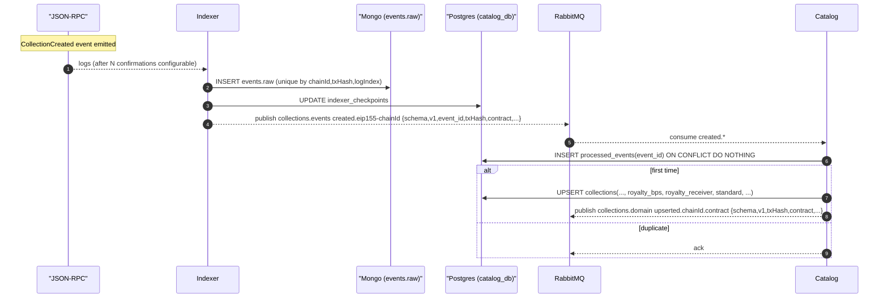

# 4. Collection Indexing Flow

## Overview

This document describes the collection indexing flow, covering blockchain event detection and catalog processing.

## Sequence Diagram



## Key Components

### Indexer Service
- Monitors factory contract events
- Processes confirmed transactions
- Stores raw event data
- Publishes structured events

### Event Detection
- **Event Filter**: CollectionCreated events from factory
- **Confirmation Depth**: Configurable confirmations (e.g., 12 blocks)
- **Batch Processing**: Multiple events per batch
- **Checkpoint Management**: Track last processed block

### Message Queue
- **Exchange**: `collections.events`
- **Routing Key**: `created.eip155-{chainId}`
- **Message Format**: Structured event data
- **Durability**: Persistent message storage

## Event Processing Pipeline

### 1. Event Detection
```javascript
// Monitor factory contract for CollectionCreated events
const filter = {
    address: factoryAddress,
    topics: [
        ethers.utils.id("CollectionCreated(address,address,string,string,uint256)")
    ],
    fromBlock: lastProcessedBlock + 1,
    toBlock: 'latest'
}
```

### 2. Raw Event Storage
```javascript
// Store complete event data
const rawEvent = {
    eventId: `${chainId}-${txHash}-${logIndex}`,
    chainId,
    blockNumber,
    blockHash,
    txHash,
    logIndex,
    address: factoryAddress,
    topics: event.topics,
    data: event.data,
    parsed: {
        collection: event.args.collection,
        creator: event.args.creator,
        name: event.args.name,
        symbol: event.args.symbol,
        timestamp: event.args.timestamp
    },
    observedAt: new Date(),
    confirmations
}
```

### 3. Checkpoint Update
```sql
UPDATE indexer_checkpoints
SET
    last_block = $1,
    last_block_hash = $2,
    updated_at = NOW()
WHERE chain_id = $3
```

### 4. Message Publishing
```javascript
// Publish to message queue
const message = {
    schema: 'collections.events.created',
    version: 'v1',
    eventId,
    chainId,
    txHash,
    contract: collectionAddress,
    creator: creatorAddress,
    name: collectionName,
    symbol: collectionSymbol,
    blockNumber,
    timestamp: eventTimestamp
}
```

## Catalog Processing

### Collection Record Creation
```sql
INSERT INTO collections (
    id,
    slug,
    name,
    symbol,
    description,
    chain_id,
    contract_address,
    creator_address,
    royalty_bps,
    royalty_receiver,
    token_standard,
    deployed_block,
    created_at,
    status
) VALUES (
    uuid_generate_v4(),
    generate_slug(name),
    $1, $2, $3, $4, $5, $6, $7, $8, $9, $10,
    NOW(),
    'active'
) ON CONFLICT (chain_id, contract_address) DO UPDATE SET
    updated_at = NOW()
```

### Metadata Enrichment
```javascript
// Fetch additional contract data
const contract = new ethers.Contract(collectionAddress, abi, provider)

const [
    name,
    symbol,
    totalSupply,
    owner,
    royaltyInfo,
    baseURI
] = await Promise.all([
    contract.name(),
    contract.symbol(),
    contract.totalSupply(),
    contract.owner(),
    contract.royaltyInfo(0, 10000),
    contract.baseURI?.() || ''
])
```

## Idempotency & Reliability

### Event Deduplication
- Unique constraint on `chainId + txHash + logIndex`
- `processed_events` table prevents reprocessing
- Safe for event replay and reprocessing
- Handles blockchain reorganizations

### Error Handling
```javascript
// Retry failed processing
const retryPolicy = {
    maxRetries: 3,
    backoffMultiplier: 2,
    initialDelay: 1000
}

// Dead letter queue for permanent failures
const dlxExchange = 'collections.events.dlx'
```

### Chain Reorganization
- Monitor block hash changes
- Reprocess affected blocks
- Update checkpoint accordingly
- Maintain data consistency

## Domain Event Publishing

### Collection Domain Event
```javascript
const domainEvent = {
    schema: 'collections.domain.upserted',
    version: 'v1',
    chainId,
    contract: collectionAddress,
    txHash,
    collection: {
        id: collectionId,
        name,
        symbol,
        creator,
        deployedAt: timestamp
    },
    metadata: {
        totalSupply,
        royaltyBps,
        baseURI
    }
}
```

### Event Routing
- **Queue**: `collections.domain.upserted`
- **Consumers**: Subscription worker, analytics
- **TTL**: Message expiration handling
- **Priority**: Event processing order