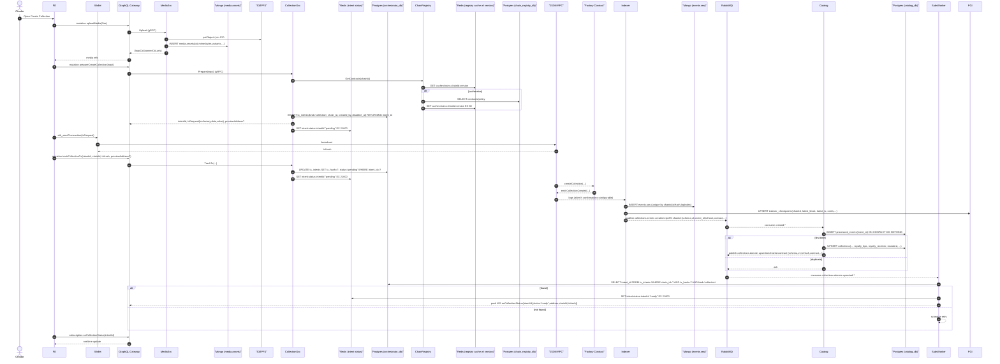

## 1. Create Collection

```mermaid
sequenceDiagram
  autonumber
  actor U as Creator
  participant FE as FE
  participant WAL as Wallet
  participant GQL as GraphQL Gateway
  participant MEDIA as MediaSvc
  participant MGM as "Mongo (media.assets)"
  participant OBJ as "S3/IPFS"
  participant COL as CollectionSvc
  participant RINT as "Redis (intent status)"
  participant PGO as "Postgres (orchestrator_db)"
  participant CHREG as ChainRegistry
  participant RREG as "Redis (registry cache w/ version)"
  participant PGR as "Postgres (chain_registry_db)"
  participant CH as "JSON-RPC"
  participant FAC as "Factory Contract"
  participant IDX as Indexer
  participant MGE as "Mongo (events.raw)"
  participant MQ as RabbitMQ
  participant CAT as Catalog
  participant PGC as "Postgres (catalog_db)"
  participant SUB as SubsWorker

  U->>FE: Open Create Collection

  %% Upload media
  FE->>GQL: mutation uploadMedia(files)
  GQL->>MEDIA: Upload (gRPC)
  MEDIA->>OBJ: putObject / pin CID
  MEDIA->>MGM: INSERT media.assets{cid,mime,bytes,variants,...}
  MEDIA-->>GQL: {logoCid,bannerCid,urls}
  GQL-->>FE: media refs

  %% Prepare calldata & intent (idempotent)
  FE->>GQL: mutation prepareCreateCollection(input)
  GQL->>COL: Prepare(input) (gRPC)
  COL->>CHREG: GetContracts(chainId)
  CHREG->>RREG: GET cache:chains:chainId:version
  alt cache miss
    CHREG->>PGR: SELECT contracts/policy
    CHREG->>RREG: SET cache:chains:chainId:version EX 60
  end
  COL->>PGO: INSERT tx_intents(kind='collection', chain_id, created_by, deadline_at) RETURNING intent_id
  COL-->>GQL: intentId, txRequest{to=factory,data,value}, previewAddress?
  COL->>RINT: SET intent:status:intentId "pending" EX 21600

  FE->>WAL: eth_sendTransaction(txRequest)
  WAL->>CH: broadcast
  CH-->>WAL: txHash
  FE->>GQL: mutation trackCollectionTx(intentId, chainId, txHash, previewAddress?)
  GQL->>COL: TrackTx(...)
  COL->>PGO: UPDATE tx_intents SET tx_hash=?, status='pending' WHERE intent_id=?
  COL->>RINT: SET intent:status:intentId "pending" EX 21600

  CH-->>FAC: createCollection(...)
  FAC-->>CH: emit CollectionCreated(...)

  CH-->>IDX: logs (after N confirmations configurable)
  IDX->>MGE: INSERT events.raw (unique by chainId,txHash,logIndex)
  IDX->>PGI: UPSERT indexer_checkpoints(chainId, latest_block, latest_tx, confs,...)
  IDX-->>MQ: publish collections.events created.eip155-chainId {schema,v1,event_id,txHash,contract,...}

  MQ-->>CAT: consume created.*
  CAT->>PGC: INSERT processed_events(event_id) ON CONFLICT DO NOTHING
  alt first time
    CAT->>PGC: UPSERT collections(..., royalty_bps, royalty_receiver, standard, ...)
    CAT-->>MQ: publish collections.domain upserted.chainId.contract {schema,v1,txHash,contract,...}
  else duplicate
    CAT-->>MQ: ack
  end

  MQ-->>SUB: consume collections.domain upserted.*
  SUB->>PGO: SELECT intent_id FROM tx_intents WHERE chain_id=? AND tx_hash=? AND kind='collection'
  alt found
    SUB->>RINT: SET intent:status:intentId "ready" EX 21600
    SUB-->>GQL: push WS onCollectionStatus(intentId,{status:"ready",address,chainId,txHash})
  else not found
    SUB-->>SUB: schedule retry
  end

  FE->>GQL: subscription onCollectionStatus(intentId)
  GQL-->>FE: realtime update


```
