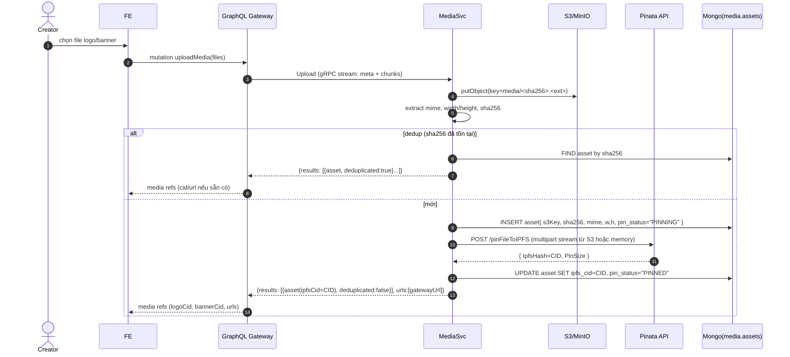
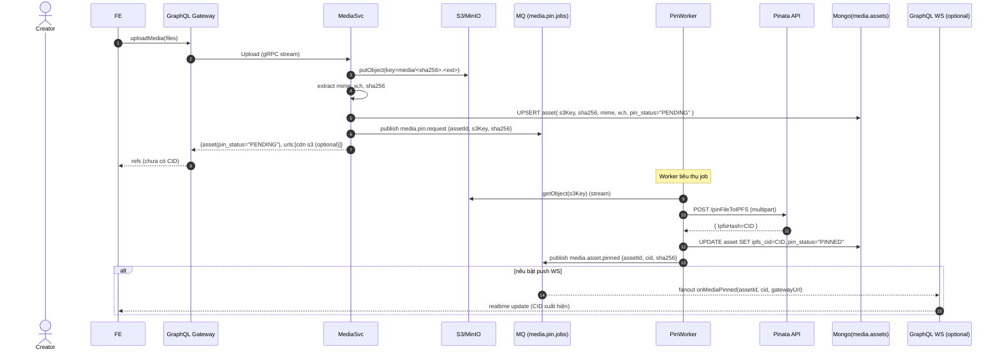

## A Upload media + Pinata (PIN SYNC)

```mermaid
sequenceDiagram
  autonumber
  actor U as Creator
  participant FE as FE
  participant GQL as GraphQL Gateway
  participant MEDIA as MediaSvc
  participant S3 as S3/MinIO
  participant PIN as Pinata API
  participant MGM as Mongo(media.assets)

  U->>FE: chọn file logo/banner
  FE->>GQL: mutation uploadMedia(files)
  GQL->>MEDIA: Upload (gRPC stream: meta + chunks)
  MEDIA->>S3: putObject(key=media/<sha256>.<ext>)
  MEDIA->>MEDIA: extract mime, width/height, sha256
  alt dedup (sha256 đã tồn tại)
    MEDIA->>MGM: FIND asset by sha256
    MEDIA-->>GQL: {results: [{asset, deduplicated:true}...]}
    GQL-->>FE: media refs (cid/url nếu sẵn có)
  else mới
    MEDIA->>MGM: INSERT asset{ s3Key, sha256, mime, w,h, pin_status="PINNING" }
    MEDIA->>PIN: POST /pinFileToIPFS (multipart stream từ S3 hoặc memory)
    PIN-->>MEDIA: { IpfsHash=CID, PinSize }
    MEDIA->>MGM: UPDATE asset SET ipfs_cid=CID, pin_status="PINNED"
    MEDIA-->>GQL: {results: [{asset(ipfsCid=CID), deduplicated:false}], urls:[gatewayUrl]}
    GQL-->>FE: media refs (logoCid, bannerCid, urls)
  end

```

## B Upload media + Pinata (PIN ASYNC qua Worker)

```mermaid

sequenceDiagram
  autonumber
  actor U as Creator
  participant FE as FE
  participant GQL as GraphQL Gateway
  participant MEDIA as MediaSvc
  participant S3 as S3/MinIO
  participant Q as MQ (media.pin.jobs)
  participant W as PinWorker
  participant PIN as Pinata API
  participant MGM as Mongo(media.assets)
  participant WS as GraphQL WS (optional)

  FE->>GQL: uploadMedia(files)
  GQL->>MEDIA: Upload (gRPC stream)
  MEDIA->>S3: putObject(key=media/<sha256>.<ext>)
  MEDIA->>MEDIA: extract mime, w,h, sha256
  MEDIA->>MGM: UPSERT asset{ s3Key, sha256, mime, w,h, pin_status="PENDING" }
  MEDIA->>Q: publish media.pin.request {assetId, s3Key, sha256}
  MEDIA-->>GQL: {asset(pin_status="PENDING"), urls:[cdn s3 (optional)]}
  GQL-->>FE: refs (chưa có CID)

  Note over W: Worker tiêu thụ job
  W->>S3: getObject(s3Key) (stream)
  W->>PIN: POST /pinFileToIPFS (multipart)
  PIN-->>W: { IpfsHash=CID }
  W->>MGM: UPDATE asset SET ipfs_cid=CID, pin_status="PINNED"
  W->>Q: publish media.asset.pinned {assetId, cid, sha256}

  alt nếu bật push WS
    Q-->>WS: fanout onMediaPinned(assetId, cid, gatewayUrl)
    WS-->>FE: realtime update (CID xuất hiện)
  end


```