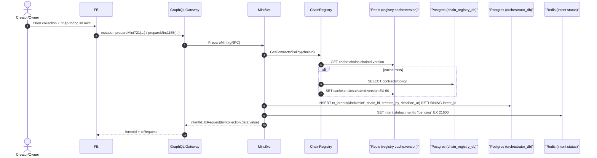

# 1. Intent Creation Flow

## Overview

This document describes the intent creation flow for NFT minting, covering the preparation phase before blockchain transaction.

## Sequence Diagram

## Key Components

### Intent Management
- Creates unique intent ID for tracking
- Stores intent in PostgreSQL with deadline
- Sets Redis status for fast lookup
- Returns transaction request data

### Chain Registry
- Provides contract addresses and gas policies
- Uses Redis cache for performance
- Falls back to PostgreSQL on cache miss
- 60-second cache TTL for fresh data

### Transaction Request
- Prepares calldata for mint function
- Calculates gas estimates
- Returns structured transaction object
- Ready for wallet signing

## Data Flow

1. **User Input**: Collection selection and mint parameters
2. **Chain Config**: Fetch contracts and policies from registry
3. **Intent Storage**: Create tracking record in database
4. **Status Cache**: Set initial pending status in Redis
5. **Response**: Return intent ID and transaction request

## Error Handling

- Chain registry failures fallback to database
- Invalid parameters return validation errors
- Intent creation failures are logged and reported
- Cache misses don't block the flow