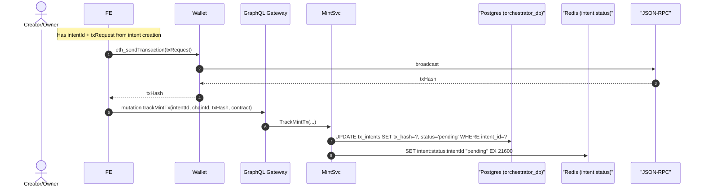

# 2. Transaction Broadcast Flow

## Overview

This document describes the transaction broadcast flow for NFT minting, covering wallet interaction and blockchain submission.

## Sequence Diagram

## Key Components

### Wallet Integration
- Supports multiple wallet types (MetaMask, WalletConnect, etc.)
- Handles transaction signing and submission
- Returns transaction hash for tracking
- Manages user rejection scenarios

### Transaction Tracking
- Links transaction hash to intent ID
- Updates intent status in database
- Refreshes Redis cache with new status
- Maintains 6-hour TTL for status cache

### Blockchain Interaction
- Uses JSON-RPC for transaction broadcast
- Handles network-specific configurations
- Manages gas price fluctuations
- Provides transaction receipt polling

## Data Flow

1. **Wallet Request**: Send prepared transaction to user's wallet
2. **User Approval**: User reviews and signs transaction
3. **Broadcast**: Wallet submits transaction to blockchain
4. **Hash Return**: Blockchain returns transaction hash
5. **Tracking**: Link hash to intent for monitoring

## Error Scenarios

### User Rejection
- User cancels transaction in wallet
- Frontend handles rejection gracefully
- Intent remains in pending state
- User can retry with same intent

### Network Failures
- RPC endpoint unavailable
- Transaction fails to broadcast
- Wallet shows appropriate error
- Intent can be retried

### Gas Issues
- Insufficient gas limit
- Gas price too low
- Network congestion
- Dynamic gas adjustment needed