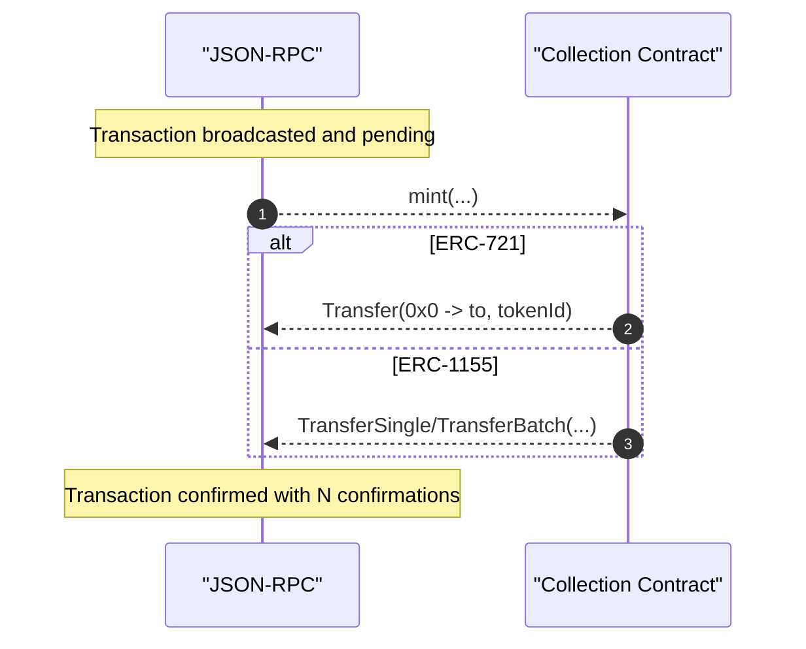

# 3. Blockchain Confirmation Flow

## Overview

This document describes the blockchain confirmation flow for NFT minting, covering smart contract execution and event emission.

## Sequence Diagram



## Key Components

### Smart Contract Execution
- Collection contract receives mint call
- Validates mint parameters and permissions
- Generates new token ID(s)
- Updates contract state

### Event Emission
- **ERC-721**: Emits Transfer event from zero address
- **ERC-1155**: Emits TransferSingle or TransferBatch
- Events contain all relevant mint data
- Used for indexing and tracking

### Confirmation Requirements
- Configurable confirmation depth (N blocks)
- Protection against chain reorganizations
- Ensures transaction finality
- Triggers downstream processing

## Token Standards

### ERC-721 Minting
```solidity
function mint(address to, uint256 tokenId) external {
    _mint(to, tokenId);
    // Emits: Transfer(address(0), to, tokenId)
}
```

### ERC-1155 Minting
```solidity
function mint(address to, uint256 id, uint256 amount, bytes memory data) external {
    _mint(to, id, amount, data);
    // Emits: TransferSingle(operator, address(0), to, id, amount)
}

function mintBatch(address to, uint256[] memory ids, uint256[] memory amounts, bytes memory data) external {
    _mintBatch(to, ids, amounts, data);
    // Emits: TransferBatch(operator, address(0), to, ids, amounts)
}
```

## Event Data Structure

### ERC-721 Transfer Event
- **from**: `0x0000000000000000000000000000000000000000` (mint)
- **to**: Recipient address
- **tokenId**: Newly minted token ID

### ERC-1155 Transfer Events
- **operator**: Address that performed the mint
- **from**: `0x0000000000000000000000000000000000000000` (mint)
- **to**: Recipient address
- **id/ids**: Token ID(s) minted
- **value/values**: Amount(s) minted

## Confirmation Process

1. **Transaction Inclusion**: Transaction included in block
2. **Initial Confirmation**: First block confirmation
3. **Deep Confirmation**: Wait for N confirmations
4. **Finality**: Transaction considered final
5. **Event Processing**: Trigger indexing pipeline