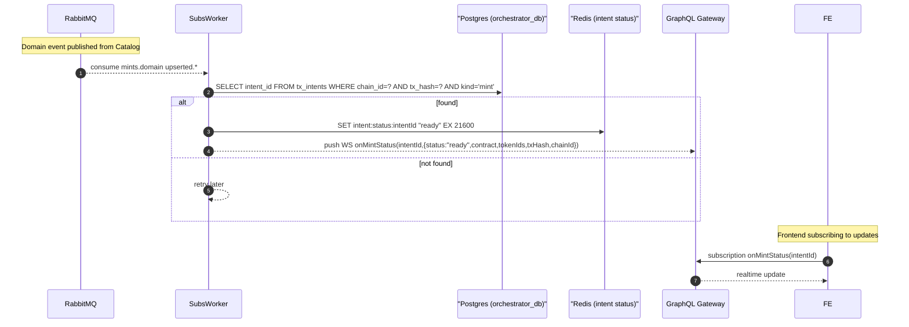

# 5. Realtime Notification Flow

## Overview

This document describes the realtime notification flow for NFT minting, covering intent completion and WebSocket updates.

## Sequence Diagram



## Key Components

### Subscription Worker
- Consumes domain events from message queue
- Links blockchain events to user intents
- Updates intent status in real-time
- Handles intent-to-transaction mapping

### Intent Resolution
- Queries orchestrator database for matching intents
- Matches by chain ID, transaction hash, and operation type
- Updates Redis cache with final status
- Maintains 6-hour TTL for status data

### WebSocket Integration
- Pushes real-time updates to GraphQL subscriptions
- Delivers status changes to connected clients
- Includes relevant transaction and token data
- Ensures immediate user feedback

### Frontend Subscriptions
- Subscribes to intent-specific updates
- Receives real-time mint status changes
- Updates UI automatically on completion
- Handles connection management

## Data Flow

1. **Event Consumption**: Worker receives domain event from queue
2. **Intent Lookup**: Find matching intent by transaction details
3. **Status Update**: Mark intent as "ready" in Redis cache
4. **Notification**: Push update through WebSocket to frontend
5. **UI Update**: Frontend receives and displays completion status

## Intent Status Lifecycle

### Status Values
- **pending**: Intent created, awaiting transaction
- **broadcast**: Transaction sent to blockchain
- **confirming**: Transaction confirmed, processing events
- **ready**: Minting complete, NFT available
- **failed**: Process failed at any stage

### Status Transitions
```
pending → broadcast → confirming → ready
   ↓           ↓           ↓
 failed     failed     failed
```

## Real-time Features

### WebSocket Subscriptions
```graphql
subscription onMintStatus($intentId: String!) {
  onMintStatus(intentId: $intentId) {
    status
    contract
    tokenIds
    txHash
    chainId
    error
  }
}
```

### Progress Tracking
- Real-time status updates
- Transaction hash linking
- Token ID revelation
- Error reporting
- Completion timestamps

## Error Handling

### Intent Not Found
- Transaction may be external mint
- Intent expired or cleaned up
- Retry with exponential backoff
- Log for investigation

### Connection Issues
- WebSocket reconnection logic
- Subscription state recovery
- Offline status handling
- Message buffering

### Failed Notifications
- Retry delivery attempts
- Dead letter queue processing
- Client reconnection handling
- Status polling fallback