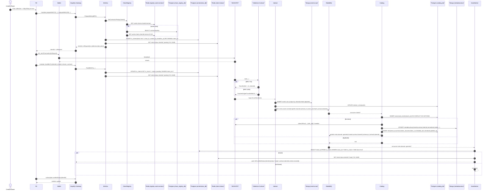

# NFT Minting Process

## Overview

This document describes the NFT minting process supporting both ERC-721 and ERC-1155 standards.

## Minting Sequence Diagram

## Minting Standards

### ERC-721 (Non-Fungible Tokens)
- Each token has a unique ID
- Single owner per token
- Suitable for unique digital assets

### ERC-1155 (Multi-Token Standard)
- Supports both fungible and non-fungible tokens
- Batch operations for efficiency
- Suitable for gaming items, collectibles

## Key Features

### Intent-Based Architecture
- Creates intent before blockchain transaction
- Tracks transaction lifecycle
- Provides real-time status updates

### Metadata Handling
- Fetches metadata from tokenURI
- Normalizes data structure
- Stores in MongoDB for fast access

### Multi-Chain Support
- Chain-specific contract configurations
- Dynamic gas policy management
- Cross-chain deployment capability

### Event Processing
- Monitors blockchain events
- Ensures idempotent processing
- Handles transaction confirmations

### Real-time Updates
- WebSocket subscriptions
- Intent status tracking
- Live minting progress