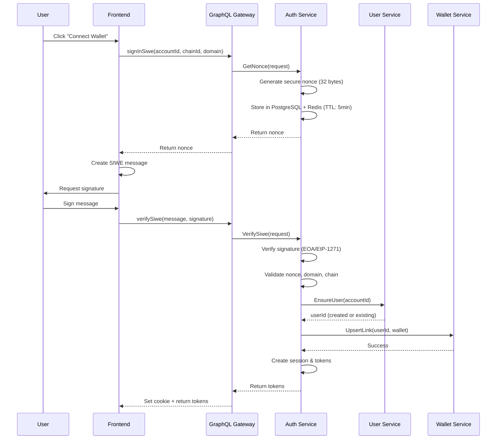
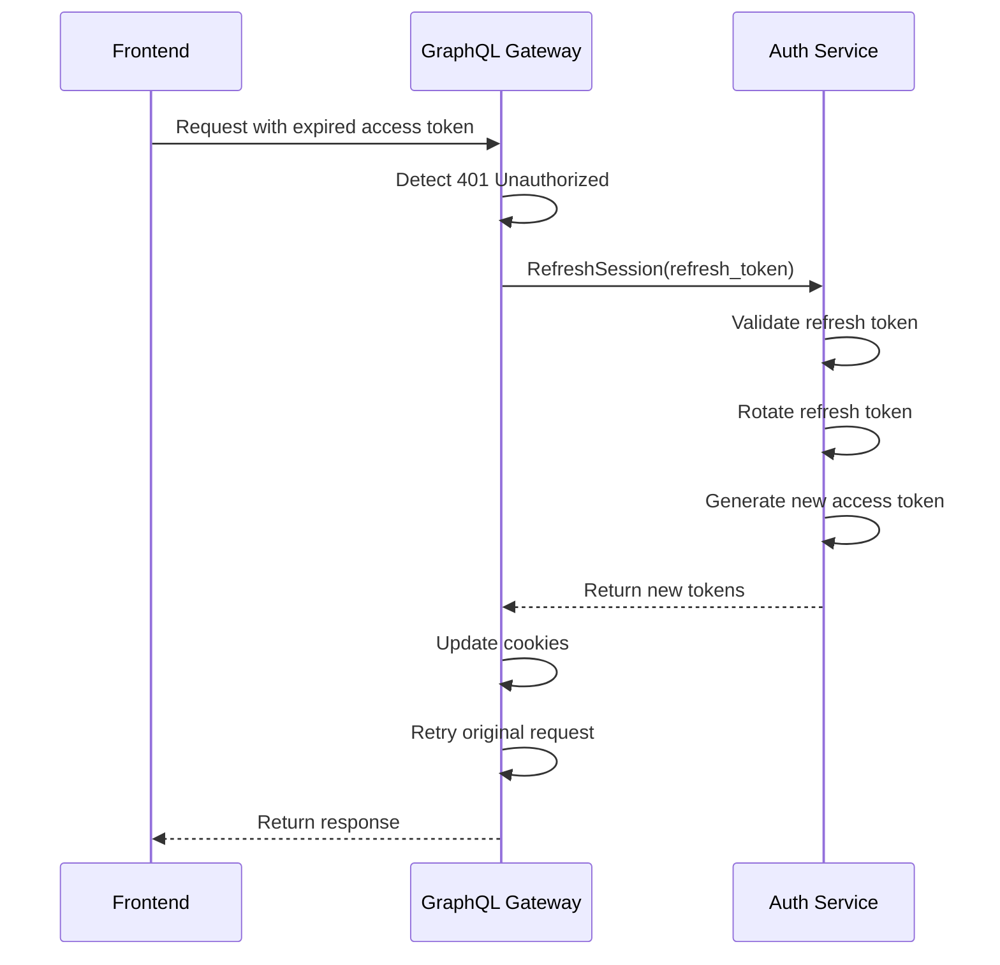

# Auth Service

## Overview

The Auth Service provides secure Sign-In with Ethereum (SIWE) authentication for the NFT Marketplace. It implements EIP-4361 compliant authentication with JWT token management, session handling, and multi-wallet support.

## Features

- **SIWE Authentication**: EIP-4361 compliant Sign-In with Ethereum
- **JWT Token Management**: Access and refresh token with rotation
- **Session Management**: Secure session handling with revocation
- **Multi-Wallet Support**: Link multiple wallets per user
- **Rate Limiting**: Method-specific rate limiting for security
- **Event-Driven**: Publishes authentication events via RabbitMQ

## Architecture

```
┌─────────────┐     ┌──────────────┐     ┌─────────────┐
│   Client    │────▶│   GraphQL    │────▶│    Auth     │
│  (Browser)  │◀────│   Gateway    │◀────│   Service   │
└─────────────┘     └──────────────┘     └─────────────┘
                            │                     │
                            │                     ├──────▶ PostgreSQL
                            │                     ├──────▶ Redis
                            │                     └──────▶ RabbitMQ
                            │
                    ┌───────▼────────┐    ┌──────────────┐
                    │  User Service  │    │Wallet Service│
                    └────────────────┘    └──────────────┘
```

## Authentication Flow

### 1. SIWE Sign-In Flow



### 2. Token Refresh Flow



## API Reference

### gRPC Methods

#### GetNonce
```proto
rpc GetNonce(GetNonceRequest) returns (GetNonceResponse);

message GetNonceRequest {
  string account_id = 1;  // Ethereum address
  string chain_id = 2;    // CAIP-2 chain ID (e.g., "eip155:1")
  string domain = 3;      // Domain requesting auth
}

message GetNonceResponse {
  string nonce = 1;       // 64 character hex string
}
```

#### VerifySiwe
```proto
rpc VerifySiwe(VerifySiweRequest) returns (VerifySiweResponse);

message VerifySiweRequest {
  string account_id = 1;  // Ethereum address
  string message = 2;     // SIWE message
  string signature = 3;   // Hex signature
}

message VerifySiweResponse {
  string access_token = 1;
  string refresh_token = 2;
  string expires_at = 3;
  string user_id = 4;
  string address = 5;
  string chain_id = 6;
}
```

#### RefreshSession
```proto
rpc RefreshSession(RefreshSessionRequest) returns (RefreshSessionResponse);

message RefreshSessionRequest {
  string refresh_token = 1;
  string user_agent = 2;    // Optional
  string ip_address = 3;    // Optional
}

message RefreshSessionResponse {
  string access_token = 1;
  string refresh_token = 2;  // New rotated token
  string expires_at = 3;
  string user_id = 4;
}
```

## Configuration

### Environment Variables

```bash
# gRPC Configuration
AUTH_GRPC_PORT=:50051

# JWT Configuration
JWT_SECRET=your-jwt-secret-key
REFRESH_SECRET=your-refresh-secret-key

# Service URLs
USER_SERVICE_URL=user-service:50052
WALLET_SERVICE_URL=wallet-service:50053

# Database Configuration
POSTGRES_HOST=localhost
POSTGRES_PORT=5432
POSTGRES_USER=postgres
POSTGRES_PASSWORD=postgres
POSTGRES_DATABASE=nft_marketplace

# Redis Configuration
REDIS_HOST=localhost
REDIS_PORT=6379

# RabbitMQ Configuration
RABBITMQ_HOST=localhost
RABBITMQ_PORT=5672
RABBITMQ_USER=guest
RABBITMQ_PASSWORD=guest

# Feature Flags
ENABLE_COLLECTION_CONTEXT=false
```

## Security Features

### Rate Limiting
- GetNonce: 10 requests/minute per client
- VerifySiwe: 5 requests/minute per client
- RefreshSession: 20 requests/minute per client

### Token Security
- Access tokens expire in 1 hour
- Refresh tokens expire in 30 days
- Refresh tokens are rotated on each use
- Tokens are hashed before storage (SHA256)

### Input Validation
- Ethereum address format validation
- CAIP-2 chain ID validation
- Domain whitelist support
- SIWE message size limits (10KB max)

### Session Security
- HttpOnly cookies for refresh tokens
- Secure flag for HTTPS only
- SameSite=Strict for CSRF protection
- Session revocation support

## Events

The service publishes the following events via RabbitMQ:

### auth.user_logged_in
```json
{
  "user_id": "uuid",
  "account_id": "0x...",
  "address": "0x...",
  "chain_id": "eip155:1",
  "session_id": "uuid",
  "logged_in_at": "2024-01-01T00:00:00Z"
}
```

## Database Schema

### auth_nonces
```sql
CREATE TABLE auth_nonces (
    nonce       varchar(64) PRIMARY KEY,
    account_id  varchar(42) NOT NULL,
    domain      varchar(255) NOT NULL,
    chain_id    varchar(32) NOT NULL,
    issued_at   timestamptz NOT NULL DEFAULT now(),
    expires_at  timestamptz NOT NULL,
    used        boolean NOT NULL DEFAULT FALSE,
    used_at     timestamptz,
    created_at  timestamptz NOT NULL DEFAULT now()
);
```

### sessions
```sql
CREATE TABLE sessions (
    session_id   uuid PRIMARY KEY DEFAULT gen_random_uuid(),
    user_id      uuid NOT NULL,
    device_id    uuid,
    refresh_hash varchar(128) NOT NULL,
    ip_address   inet,
    user_agent   text,
    created_at   timestamptz NOT NULL DEFAULT now(),
    expires_at   timestamptz NOT NULL,
    revoked_at   timestamptz,
    last_used_at timestamptz DEFAULT now(),
    collection_intent_context JSONB DEFAULT NULL
);
```

## Development

### Running Locally

```bash
# Start dependencies
docker-compose up -d postgres redis rabbitmq

# Run migrations
migrate -path ./db -database postgresql://... up

# Start the service
go run cmd/main.go
```

### Testing

```bash
# Run unit tests
go test ./...

# Run with coverage
go test -v -race -coverprofile=coverage.out ./...

# View coverage report
go tool cover -html=coverage.out
```

### Building

```bash
# Build binary
go build -o bin/auth-service cmd/main.go

# Build Docker image
docker build -t auth-service:latest .
```

## Monitoring

### Health Check
```bash
grpc_health_probe -addr=localhost:50051
```

### Metrics
- Login success/failure rate
- Token refresh rate
- Nonce usage rate
- Session creation/revocation rate
- Rate limit hit rate

### Logging
Structured logging with levels:
- INFO: Normal operations
- WARN: Rate limits, validation failures
- ERROR: Service errors, dependencies failures
- DEBUG: Detailed debugging (dev only)

## Troubleshooting

### Common Issues

#### "Nonce expired or already used"
- Nonce has 5-minute TTL
- Each nonce can only be used once
- Generate new nonce if expired

#### "Invalid signature"
- Ensure message format matches SIWE standard
- Check address matches signer
- Verify chain ID is correct

#### "Rate limit exceeded"
- Wait before retrying
- Check rate limit configuration
- Consider increasing limits if legitimate

## License

MIT
